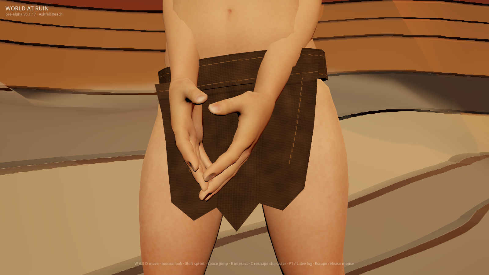
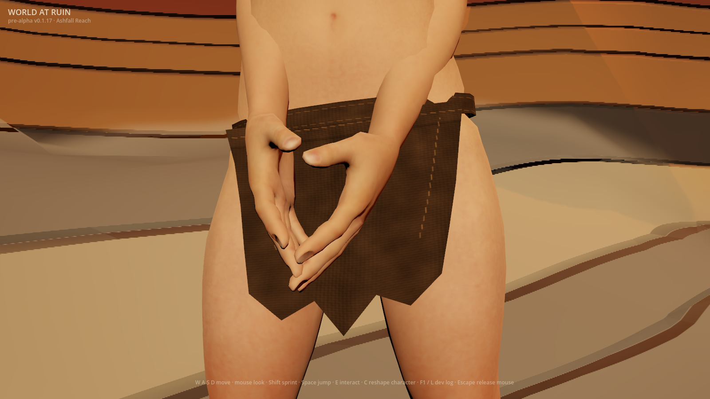
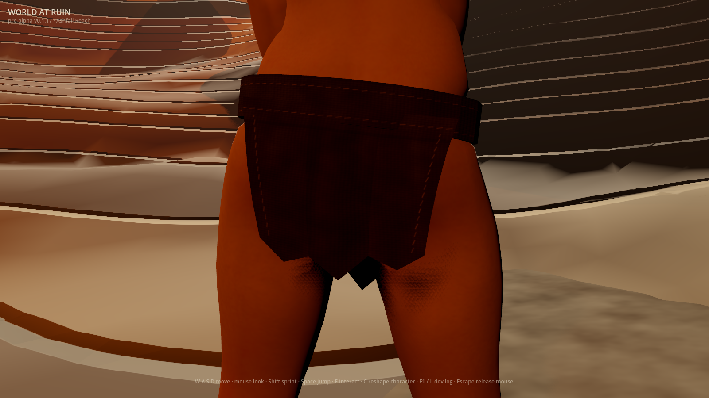
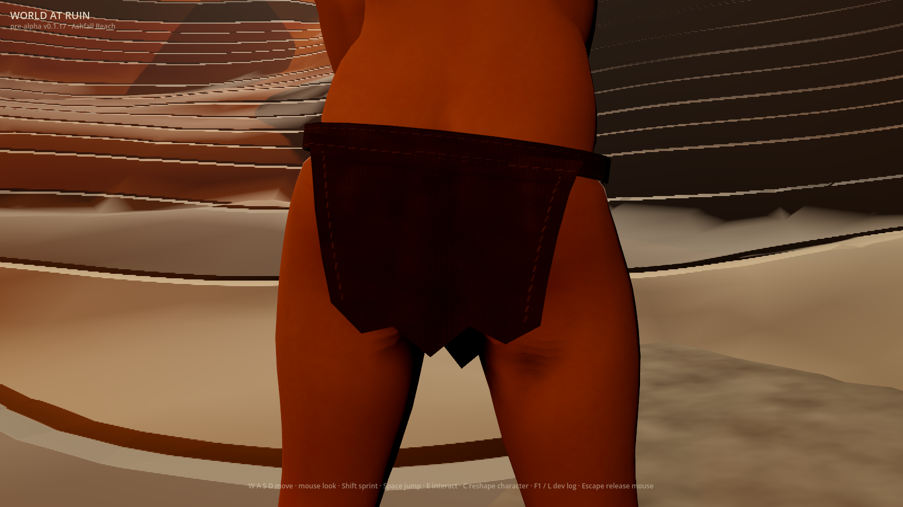
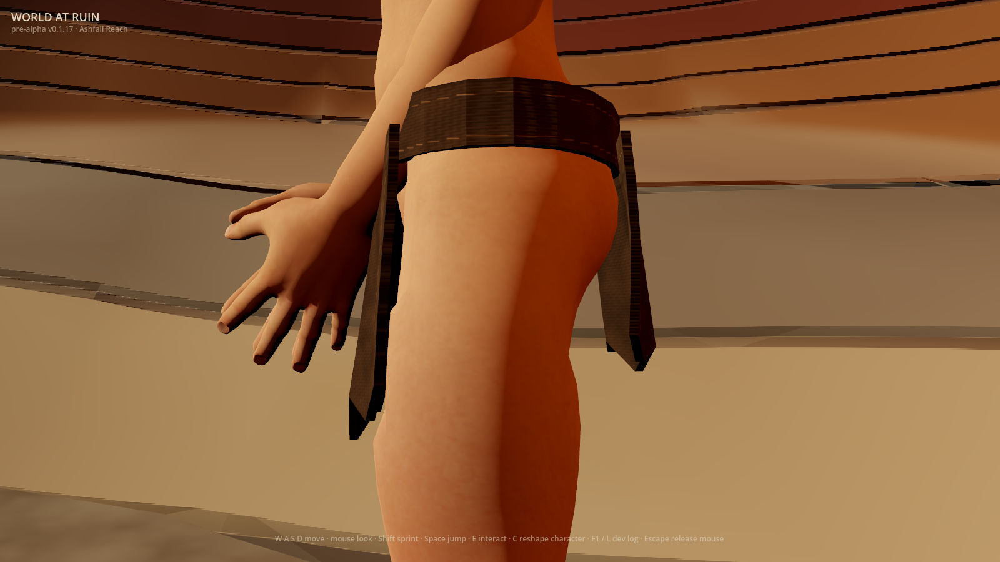
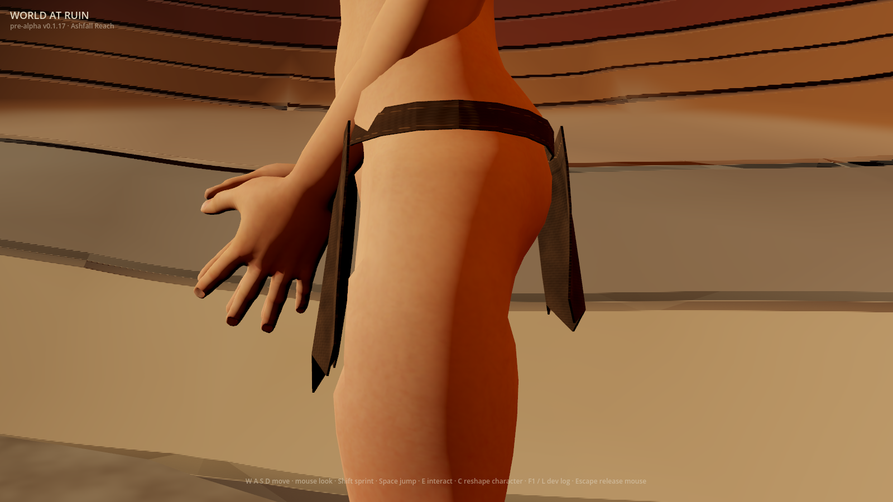
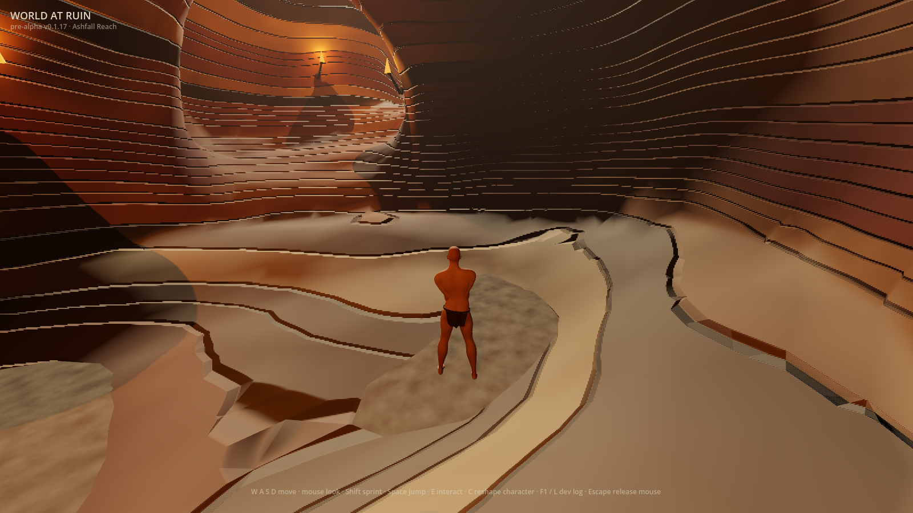

# A softer waist and closed panel edge (#1273)

`WAR_RAGGED_CLOTH_DRAPE=1` narrows the original wrap's waist and thins its
closed shell while retaining the prior outward gathers. It also restores the
upper strip of skin that the original equipment inset tucked under the wider
band. The material preview remains independent. Both previews stay default-off;
saved characters and imported assets are unchanged.

## Whole actual game frames

Godot 4.7.1, Metal Forward+, Apple M2 Pro, 1600×900, 2026-10-06. These whole,
unretouched first-party frames use the actual first-run Wanderer, an empty
wardrobe, absent temporary saves, both previews enabled, and fixed pose,
lighting and cameras. The development HUD is not a release receipt. Exact
image bytes are recorded in `docs/first-party-captures.sha256`.

| Prior waist and shell, same build | Refined preview |
|---|---|
|  |  |
|  |  |
|  |  |
|  |  |

The `_unrefined` arm restores the previous waist, shell and skin inset while
retaining prior geometric drape, material, body shape, pose and lighting. It
isolates this refinement from the older folds. The existing `_geometry_flat`
arm instead removes all geometric drape. The inspection views use the existing
36° lens; gameplay retains the real 70° follow camera and 4.6 m spring arm.

The profile shows a narrower belt and thinner panel edge than the control. The
front and rear keep the original silhouette and sewing; the gameplay change
remains small at the real follow-camera distance. These frames also expose
the continuing angular garment and cave-rendering gaps.

## Geometry and saved characters

The real first-run composed mesh measures **25.000 mm** band height and
**2.240 mm** panel thickness, versus the independent imported control's
**52.000 mm** and **8.000 mm**. The attachment remains fixed. Welded triangle
edges still have exactly two incident faces, and a deliberately missing-face
control fails that closed-surface criterion.

Thinning adapts to the complete selected morph field. Negative saved belly
shapes, combined negative belly/buttocks shapes and live creator edits retain
approximately **1 mm** positively ordered shell separation. Larger accepted
shapes can retain a thicker shell; the 3 mm acceptance bound belongs to the
first-run Wanderer, not every historical morph. No accepted value is clamped,
rejected or rewritten. Recomposition starts from the immutable imported mesh
and preserves all positional morph deltas, UVs, indices and skin bindings.

An independent actual morphed/skinned-body comparison finds **0 mm** upper
waist dent across current presets and historical recipes, versus the old inset's
**12 mm**. Only the newly exposed upper equipment-inset strip is restored in a
private body mesh. Other equipment insets and all player morph targets remain
unchanged. The existing independent rear-body clearance and buried/missing-body
controls remain required.

The capture measures maximum-channel image difference over the union of the
actual and unrefined garment masks. Front, rear and profile must exceed three
times repeated-frame noise plus 0.004; gameplay records the distant result
without claiming inspection-scale detail. Flat-material, folds-off, sewing-off
and all-geometry-off arms remain separate. CI requires the new control frames
in every independent material/geometry flag state.

| View | Union garment samples | Refinement-only signal | Repeat noise |
|---|---:|---:|---:|
| Front | 40,259 | 0.07120 | 0.00000 |
| Rear | 46,670 | 0.06489 | 0.00000 |
| Profile | 19,394 | 0.18506 | 0.00000 |
| Gameplay | 1,124 | 0.07051 | 0.00006 |

These are observations of this run, not an art score or a cross-machine target.
An advisory native headless benchmark of character construction plus one
negative-belly live edit measured a 108.9 ms median over ten warmed samples
with the geometry preview, versus 17.2 ms with it off. This does not measure
steady-state frame rate; the derived mesh is static between creator edits.

## Reference and remaining gap

The approved ragged-start reference is the official **Elden Ring Wretch**:
[reference page](https://en.bandainamcoent.eu/elden-ring/elden-ring/characters/wretch),
[Wretch1 image viewed online](https://static.bandainamcoent.eu/high/elden-ring/elden-ring/05-characters/classes-gallery/assets/ELDEN-RING-Class-Wretch1.jpg).
The reference was viewed online, never downloaded into the repository or used
as generator input. Its sparse cloth reads within a cohesive character and
environment composition.

This opt-in improvement remains **below the agreed AAA bar**. The angular cut,
abrupt reinforcement ends, loose fraying, cloth motion, body shading and cave
composition still need work. This slice judges static shape, not animation or
Phase 0 acceptance. #222 and #1 remain open. The separate #947 and #950
2026-11-01 accept-or-retire decisions remain open; their dates never activate a
preview.

## Originality

- **Abstract target:** a sparse worn garment has a narrow folded waist and thin
  closed edges, distinct from a rigid plate.
- **Independent choices:** retain the original angular brown two-panel cut;
  compress its original elliptical waist smoothly toward its fixed attachment;
  thin toward the original parametric panel exterior with saved-shape-dependent
  face separation; retain the first-party gathered material, cave lighting and
  existing cameras.
- **Excluded reference-specific expression:** no Wretch cut, mesh, textures,
  character, weapon, framing or environment was copied.
- **Inputs and provenance:** existing first-party kit, original arithmetic and
  whole first-party runtime captures. No reference media or new dependency.
- **Remaining similarity risk:** the approved near-naked ragged-start premise
  is shared; the reference's distinctive expression is excluded. Future cut,
  fraying and motion require their own reference-distance judgment.

## Reproduce

Use a fresh directory with absent save files. Repeat with independent flag
values `0/0`, `0/1`, `1/0` and `1/1`. Each run captures front, rear, profile and
gameplay with all ten actual/control arms.

```sh
rtk mkdir -p /tmp/war-soft-wrap
rtk proxy env WAR_RAGGED_CLOTH_DETAIL=1 WAR_RAGGED_CLOTH_DRAPE=1 \
WAR_SCENARIO=ragged_cloth WAR_SHOT_DIR=/tmp/war-soft-wrap \
WAR_SAVE_PATH=/tmp/war-soft-wrap/character.json \
WAR_VAULT_PATH=/tmp/war-soft-wrap/vault.json \
WAR_BOOT_RECOVERY_PATH=/tmp/war-soft-wrap/recovery.json \
godot --path client res://tools/frame_capture.tscn
```

Run `tools/run-client-test.sh` for `ragged_wrap_shape_test`,
`ragged_waist_skin_test`, `ragged_refinement_capture_test` and
`ragged_morphed_shell_test`, alongside the existing ragged-cloth and equipment
regressions. Each new behavioral test was observed failing against its
unrefined or unsafe control before the implementation passed it.
