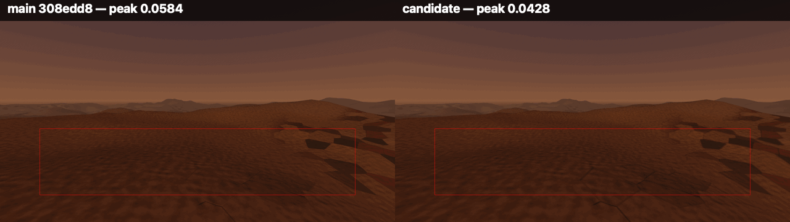

# Plate contacts stay coherent under camera motion (#306)

Exact-main and candidate captures from the same fixed camera, save, world seed,
renderer and 1280×720 viewport. Read each half through the loop: the left side
is exact main `308edd877a95bc033dc7aed8b6ea2a8581cac131`; the right side is the
candidate `a09283d7b446f1e67267c4eb198b20c9a6ce61ec`. The red rectangle is the
ground-only crop `plate_crawl` measures.



The loop contains the four production camera phases in order and then reverses
them for a continuous comparison. Each half is a half-resolution presentation
of the raw 1280×720 capture; no colour grade, sharpening or frame interpolation
was applied.

## Measurement

Both builds ran windowed on Godot 4.7.1, Apple M2 Pro, Metal Forward+, with the
same redirected `client/recipes/wanderer.json` save and the same settled world.
The plates-off control is identical across the two builds:

| Measure | Exact main | Candidate |
|---|---:|---:|
| plates-off peak luma move | 0.0226 | 0.0226 |
| plates-on peak luma move | 0.0584 | 0.0428 |
| plates-on crop spread | 0.1608 | 0.1655 |

The candidate crosses below the instrument's 0.05 flicker line without reducing
the crop's material spread. The headless mutation test covers the sparse case
that rounds to `0.0000` in the tool's four-decimal flicker-fraction report: the
shipped pale-stone/basalt contact moves by `0.02790` luma under a quarter-pixel
step, while the old half-footprint control moves by `0.10285`. The unresolved
cavity similarly moves from the old control's `0.10154` to `0.03767`, while its
integrated energy rises from `0.11611` to `0.31644` rather than being softened
away.

## Reference and judgement

The moving reference is
[Fatekeeper, Official Gameplay Announcement Trailer, 1:13–1:17](https://www.youtube.com/watch?v=m1A8rnf9Tmk&t=73s):
the moving first-person camera keeps high-contrast rubble and stone contacts
legible without surface breakup. The candidate takes only that temporal-stability
target. It keeps the Reach's named plate substances, plate-to-ash silhouette and
cavity read while removing the contact flash that main still crosses.

The remaining gap is substantial. Fatekeeper's authored stone geometry, surface
density, lighting and compositional hierarchy remain materially ahead of this
procedural terrain. This evidence supports temporal coherence only; it does not
claim fidelity parity or make the wider plate treatment ready for default-on
use.

## Originality

The reference was inspected only to identify the abstract relationships of
temporal stability, contact legibility and value separation. No Fatekeeper
frame, texture, geometry, motion data or other media is retained or committed,
traced, transformed, used as generator input, or copied into the implementation.
The loop above contains only first-party World at Ruin captures and is byte-bound
in `docs/first-party-captures.sha256`.

## Regenerate

Run each revision from an isolated worktree, using the same save seed and output
conditions:

```sh
mkdir -p /tmp/war-plate-crawl
cp client/recipes/wanderer.json /tmp/war-plate-crawl/save.json
WAR_CRAWL_SHOT_DIR=/tmp/war-plate-crawl \
WAR_SAVE_PATH=/tmp/war-plate-crawl/save.json \
WAR_VAULT_PATH=/tmp/war-plate-crawl/vault.json \
WAR_BOOT_RECOVERY_PATH=/tmp/war-plate-crawl/boot-recovery.json \
godot --path client --resolution 1280x720 res://tools/plate_crawl.tscn
```

The tool writes `plates-on.png` plus `plates-on-step-1.png` through
`plates-on-step-3.png` (and the matching plates-off control sequence). Compare
only runs from the same renderer and environment, as the tool requires.
