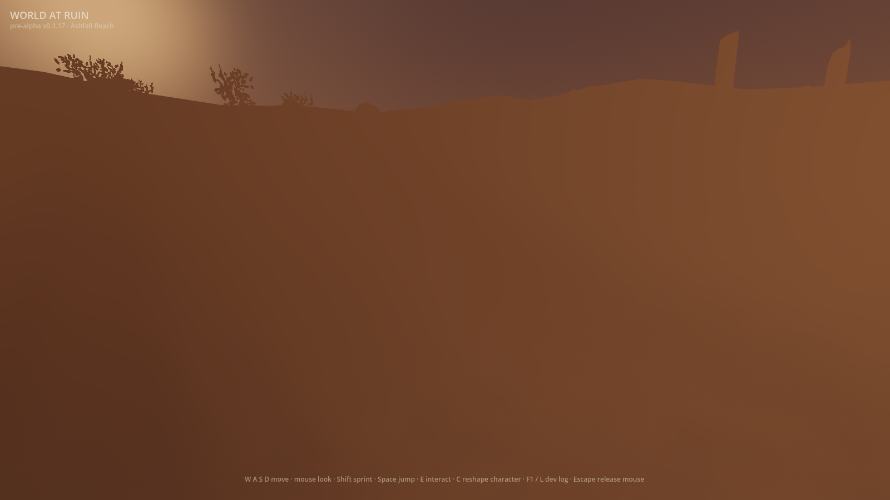

# Ash moves inside the hollows (#328)

Raw, ungraded 1600×900 evidence for the default-off spatial ash field. Every
frame boots the shipped main scene on Godot 4.7.1, Metal Forward+, Apple M2 Pro,
with `WAR_ASH_FIELD_DRIFT=1`, redirected player-state seams, `VOLUMETRICS on`,
`HOLLOW FOG on — 6 ash pools with spatial field drift`, and `BOOT_OK`.

The camera stands at player height **inside** the first shipped pool, looks
mostly crosswind so advection crosses the frame, and stays fixed throughout.
`frame_capture.gd` freezes every other scene animation. The three controls hold
the production field clock at one value; the eight phases advance only that
clock by 0.5 seconds each.

## Same-state controls

| Control 1 | Control 2 | Control 3 |
|---|---|---|
|  |  |  |

All three pairwise comparisons establish the same-run renderer floor:
**maximum mean |dRGB| 0.0006, 0.00% changed pixels**.

## Real production-clock sequence

| 0.5 s | 1.0 s | 1.5 s | 2.0 s |
|---|---|---|---|
|  |  |  |  |

| 2.5 s | 3.0 s | 3.5 s | 4.0 s |
|---|---|---|---|
|  |  |  |  |

The four-second frame compared conservatively against **every** control measures
**minimum mean |dRGB| 0.0072 and 31.79% changed pixels**. That is reported
against the floor rather than turned into a taste threshold, as #328 requires.
The pure field laws separately prove that the same pattern translates on the
shared `Wind`, remains positive, spans more than two primary pockets per pool,
and retains the placed density as its temporal mean.

## References and judgement

The moving reference is the
[Fatekeeper Early Access Release Trailer at 1:05–1:08](https://www.youtube.com/watch?v=wpShpSfDOSE&t=65s):
multi-scale smoke moves while keeping readable gaps between billows rather than
shifting one flat exposure. The execution plate is
[Fatekeeper official gallery screenshot 02](https://fatekeeper.thqnordic.com/game-sites/fatekeeper/content/screenshots/screenshot-02.png):
layered mist preserves foreground silhouettes and terrain depth.

The field motion is real and clears its same-run floor, but the remaining gap is
plain: World at Ruin still reads as a broad warm veil rather than clear layered
gaps and fine billows. The feature therefore stays default-off.
[Issue #577](https://github.com/devantler-tech/world-at-ruin/issues/577)
owns the player judgement, performance evidence, and same-change retirement of
the flag and settled alternate path.

## Originality

The references were viewed only in official THQ Nordic media. No reference
media was downloaded, committed, traced, transformed, or used as generator
input. This implementation borrows only the abstract cue of spatial particulate
advection. Its concrete expression is independent: four analytic world-space
harmonics, the existing Reach `Wind`, and World at Ruin pool geometry, density,
floor bias, rim and ash colour. Fatekeeper geometry, assets, palette, particle
silhouettes, composition and timing are excluded.

## Regenerate

Run the windowed `ash_motion` scenario with all player-state seams redirected:

```sh
WAR_ASH_FIELD_DRIFT=1 \
WAR_SCENARIO=ash_motion \
WAR_SHOT_DIR=/tmp/ash-motion \
WAR_SAVE_PATH=/tmp/ash-motion-character.json \
WAR_VAULT_PATH=/tmp/ash-motion-vault.json \
WAR_BOOT_RECOVERY_PATH=/tmp/ash-motion-recovery.json \
godot --path client --resolution 1600x900 res://tools/frame_capture.tscn
```
