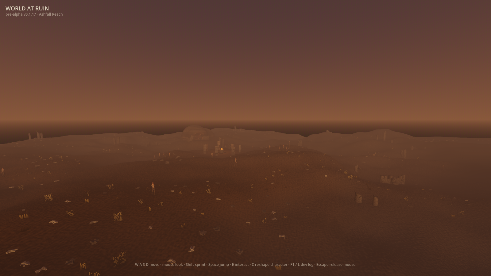
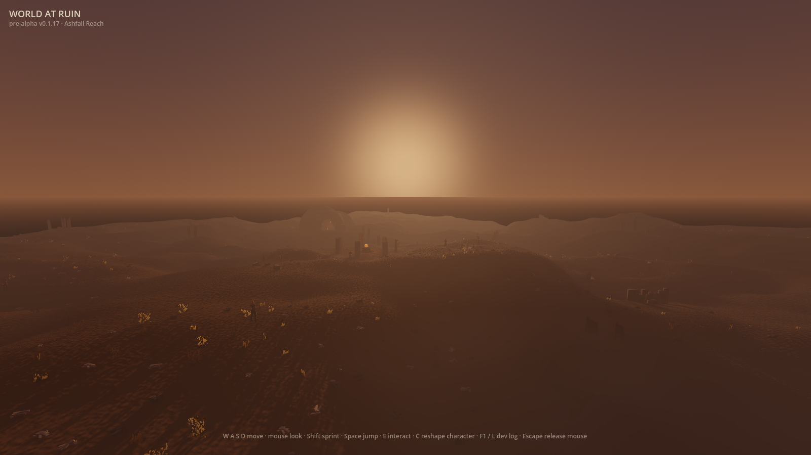
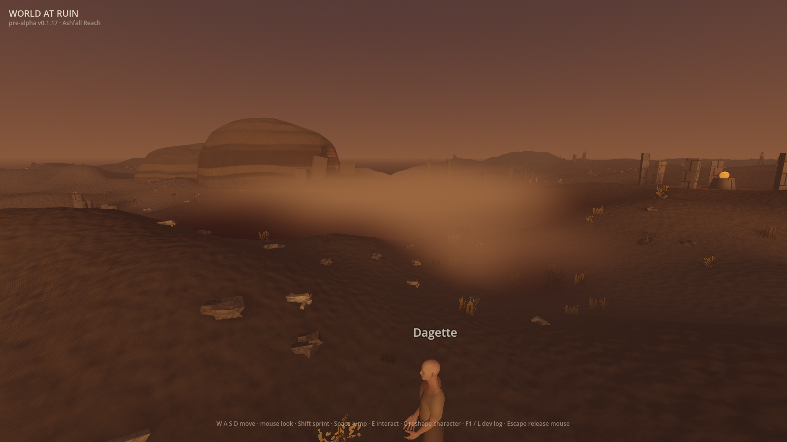
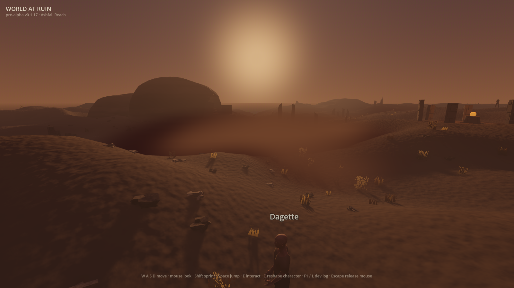

# Issue 346 — moving-sun material response

These are raw, ungraded 1600×900 frames from the shipping world and materials.
Each pair holds the camera, generated world, foliage and hollow-ash volume at
one frozen animation phase. Only the real `DirectionalLight3D` named `Sun`
moves:

- **source side:** light rays travel with the camera ray (`dot = +1.000`);
- **far side:** the horizontal azimuth reverses while the Sun retains the same
  above-terrain elevation (`dot = -0.984` for foliage, `-0.928` for ash).

Capture conditions: Godot 4.7.1, Metal Forward+, Apple M2 Pro,
`VOLUMETRICS on`, `HOLLOW FOG on — 6 drifting ash pools`. All save paths were
redirected to disposable files. `client/tools/frame_capture.gd` owns the exact
camera and light geometry and regenerates the four frames with
`WAR_SCENARIO=light_response`. The capture also hides the built `HollowFog`
subtree without moving the camera or light and fails unless the ash changes
rendered pixels; this run changed 43/192 sampled pixels source-side and 40/192
far-side.

## Foliage response

The broad view keeps the generated crossed-card scrub in context. Source-facing
cards take the warm direct key; the opposite direction keeps the weaker
transmitted response.

| Source side | Far side |
|---|---|
|  |  |

## Hollow-ash response

The close view looks through the deepest shipped `FogVolume` onto terrain so
the scattering response cannot disappear against empty sky. The cloud is
brightest from the side the light enters and stays visible, but darker, from the
far side.

| Source side | Far side |
|---|---|
|  |  |

## Art-direction check

The named reference is Fatekeeper under
[`docs/art-direction/README.md`](../../art-direction/README.md#lighting-and-atmosphere).
The exact
[official forest frame](https://shared.fastly.steamstatic.com/store_item_assets/steam/apps/2186990/6bfe9f07df35adf67189edfa3e9319460960ebca/ss_6bfe9f07df35adf67189edfa3e9319460960ebca.1920x1080.jpg)
shows the target relationship: a bright atmospheric source, light caught by the
near foliage, readable depth through haze, and darker material away from the
key.

The remaining gap is explicit: Ashfall Reach does not yet have a day/night
cycle, so ordinary play keeps the Sun fixed. The corrected materials consume
the live renderer light and the frames above prove their response follows it
when that light moves.
