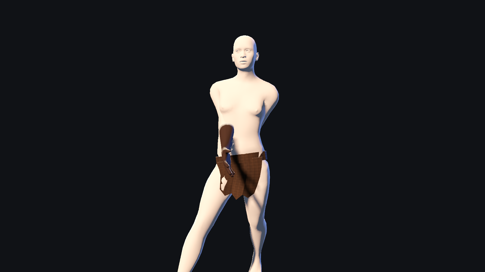

# Ashen bindings reader proof (#542)



This raw 1600×900 Godot 4.7.1 Metal frame renders the real `CharacterFactory` result for a
future recipe carrying `equipment.hands = "ashen_bindings"`. The test first proves the same
instance is a skinned, shaped hand-slot mesh, then fixes one phase through the shipped
`WalkLocomotion.apply_phase()` path so the near arm and its full cuff remain inspectable.

Regenerate it with:

```sh
WAR_ASHEN_BINDINGS_SHOT=/tmp/ashen-bindings.png \
  godot --path client --resolution 1600x900 \
  res://tests/ashen_bindings_reader_test.tscn
```

This is reader evidence, not a hidden preview or production preset. The test separately proves
that neither state of `WAR_LAYERED_OUTFIT_PICKERS` offers the name and that the capability-4
writer vocabulary refuses to originate it.

## Art-direction comparison

The named reference is the first-party
[`Characters, clothing and equipment`](../../art-direction/README.md#characters-clothing-and-equipment-222-224-228)
brief. Its early progression calls for ragged equipment before the material tiering of later
armor. The scalloped long cuffs add the first hand-slot silhouette, use the armor layer over bare
hands, and keep a muted ash-brown value beside the starting cloth rather than reading as earned
metal.

No third-party reference frame was used. The source mesh is
`culturalibre_hero-heroine_gloves_5` from MakeHuman's official `gloves01_cc0.zip`; it is a
CC0 generator input recorded with the exact archive checksum and output digests in the humanoid
kit provenance record. Independent choices in this change are the stable name, slot/layer,
ash-brown material values, reader-only contract boundary, and fixed evidence framing. It does not
copy the named brief's supporting game protagonists, armor designs, UI, or composition.

## Remaining gap

The flat bake material does not yet carry cloth grain, stitched seams, or age variation, so it
clears the reader and silhouette stage without meeting the later material-differentiation target.
The standing rest also hides one cuff behind the torso; this evidence uses the real fixed walk
phase to show the near cuff rather than presenting the default pose as a complete view. #544 owns
writer activation after a retained capability-5 reader release and must judge a fresh running
frame before exposing the piece. #336 still owns replacing the raw layered-outfit preview with an
authored wardrobe surface.
