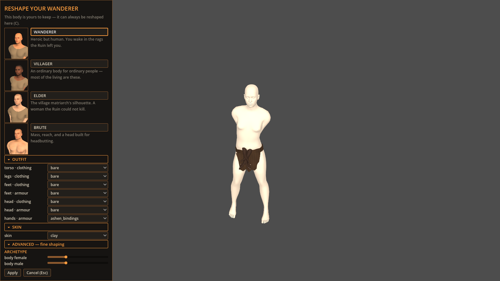

# Ashen bindings writer proof (#544)



This raw 1600×900 Godot 4.7.1 Metal frame shows the real opt-in
`CharacterCreator` after its `hands · armour` picker selected
`ashen_bindings`. The same test applies that visible picker state through the
creator's real signal, saves the resulting recipe with `CharacterStore`, reloads
it, and rebuilds it with `CharacterFactory`.

Regenerate it with:

```sh
WAR_ASHEN_BINDINGS_SHOT=/tmp/ashen-bindings-writer.png \
  godot --path client --resolution 1600x900 \
  res://tests/ashen_bindings_reader_test.tscn
```

The test controls `WAR_LAYERED_OUTFIT_PICKERS` itself and proves both states:
the default creator cannot originate this preview-only piece, while the explicit
opt-in exposes and persists it. The capability-5 reader dependency shipped in
`v0.69.0`; this activation advances writes to capability 5 while keeping reads
at capability 6.

## Art-direction comparison

The concrete visual reference remains this
[official Kingmakers Steam screenshot](https://shared.akamai.steamstatic.com/store_item_assets/steam/apps/2109770/ss_d76ac84d00070e687f758926a67a8dca58636e6d.1920x1080.jpg).
Its front-facing infantry silhouette keeps hand and forearm protection readable
through a distinct material response, overlapping forms, and a clear wrist
break. The first-party
[`Characters, clothing and equipment`](../../art-direction/README.md#characters-clothing-and-equipment-222-224-228)
brief asks for the same readable armour ladder without copying the reference's
protagonist or composition.

## Originality note

- **Abstract target:** make an early hand-armour layer readable at creator
  distance and preserve it as an equipment choice.
- **Independent choices:** long scalloped cuffs, muted ash-brown soft material,
  the `hands · armour` slot, a default-off preview boundary, and the existing
  creator framing.
- **Excluded expression:** no Kingmakers firearm, heraldry, plate articulation,
  battlefield, protagonist, UI, or screenshot composition was copied.
- **Input provenance:** the mesh is `culturalibre_hero-heroine_gloves_5` from
  MakeHuman's official CC0 `gloves01_cc0.zip`; archive and output digests are
  recorded in the humanoid-kit provenance ledger. The Kingmakers image remained
  link-only and view-only.
- **Remaining similarity risk:** only the broad idea of readable forearm
  protection remains shared; the silhouette, material, colour, context, and
  interface are independently expressed.

## Remaining gap

The flat material still lacks cloth grain, stitched seams, and age variation,
so the piece does not yet satisfy the later material-differentiation target.
The default creator intentionally hides it, and the opt-in surface shown here is
still the raw layered picker rather than an authored wardrobe. #336 owns that
interface replacement.
