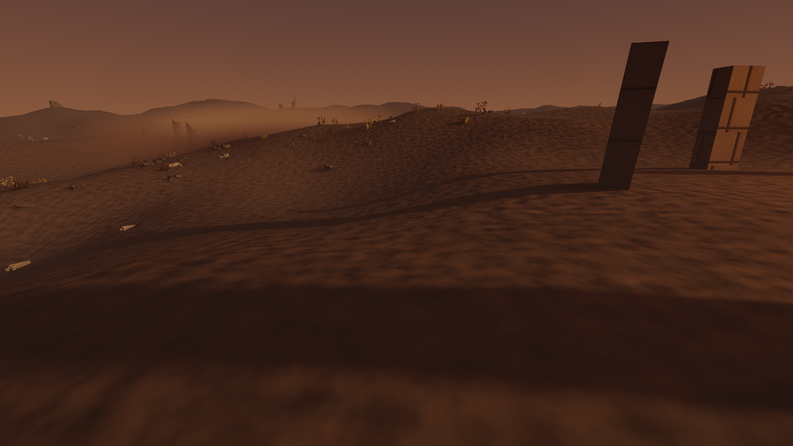
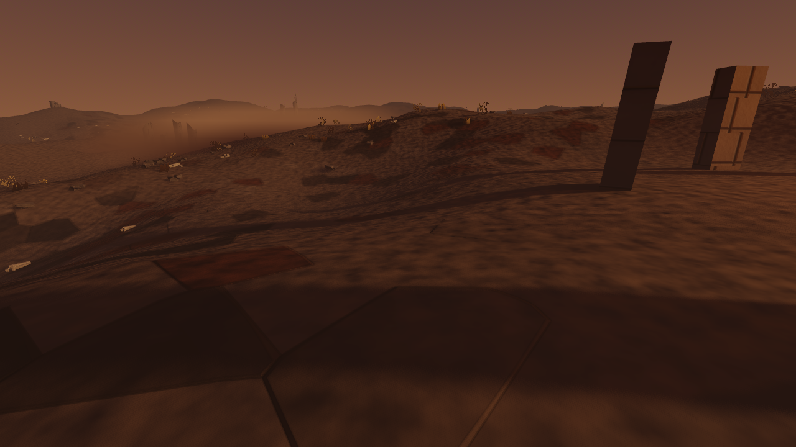
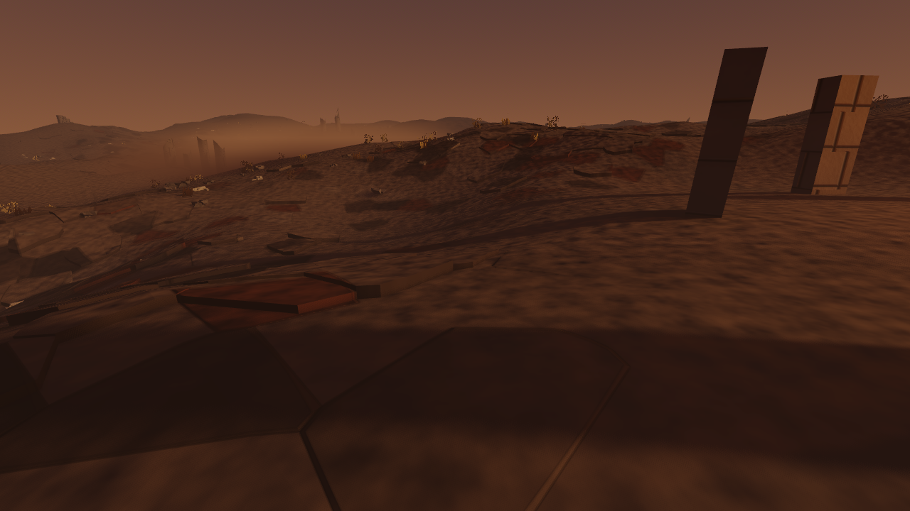

# Raised exposed-stone geometry (#547)

Close-range evidence for the default-off `WAR_GROUND_PLATES` treatment gaining real
thickness. All frames are raw, ungraded 1280×720 captures from the shipping world
(Godot 4.7.1, Metal Forward+, volumetric fog on, VSync disabled), taken by
`client/tools/plate_geometry_budget.gd` from a walking-height camera 4.8 m from the
built slab nearest the shrine, looking down at it — the range #272 names as the one
where flat paint fails.

| Treatment off | Shader paint only (what shipped before) | Paint + raised geometry |
|---|---|---|
|  |  |  |

The middle and right frames are the same build with the same uniform; only the
overlay's visibility differs. `frame_diff`-style luma comparison in the tool measured
**0.79% of pixels moved by more than 0.05 luma** between them — the lips and the
occluded ground behind them — against 6.1% between off and on.

## What the frames show

The off frame is wind-smoothed ash. The shader-only frame is #261's decided ground:
named substances in irregular slabs, but every slab is a mark on the surface — the
ferric slab left of centre has no edge a boot could catch. In the on frame that slab
stands off the ash on a dark side face and hides the ground behind its far lip; the
pale slabs in the foreground read as plates with a rim rather than outlines, and the
ridge in the mid-field breaks into stone with silhouettes against the slope instead of
a stained surface.

## How the density was chosen

The shader decides exposure per fragment, so the ash sheet's contact routinely crosses
a 1.2 m slab. A slab lifted with ash still painted over most of its top reads as a
raised drift. `ExposedSlabGeometry.MIN_EXPOSED_CORNER_SHARE` is the share of a slab's
corners that must be exposed beside its site before it is lifted; three values were
rendered from the same camera and judged:

| Share | Slabs lifted | Triangles | Read |
|---|---:|---:|---|
| 1.0 — every corner | 439 | 14,476 | sparse random tiles; most painted slabs stay flat ([frame](alt-share-1.0-on.png)) |
| **0.5 — half the corners (chosen)** | **3,438** | **116,759** | scattered broken slabs; lips catch the light along the ridge |
| 0.0 — site only | 5,424 | 184,321 | the mid-field starts to pave ([frame](alt-share-0.0-on.png)) |

The two alternative frames are half-size, were rendered before shadow casting was
switched off, and stood 1.2 m further from the slab (the nearest built slab moves with
the rule), so compare their density, not their pixels.

## Cost — and what could not be measured

ADR 0001 asks for the viewport's measured GPU frame time over 600 steady frames per
state. `RenderingServer.viewport_get_measured_render_time_gpu` returned **0.0 ms in
every one of 2,400 frames** on every Metal run here — the same silence the ADR records
for the command-line profiler — so the GPU budget is **UNAVAILABLE on this host, not
passed**. The tool refuses to pass on it and reports wall-clock frame time beside it as
a GPU-bound proxy, and it refuses that too whenever the frame is display-paced.

One run of the tool on this host was unthrottled (VSync off, a 6.25 ms CPU floor in the
off state, so the on states were GPU-bound and their wall-clock deltas bound what a
player feels):

| State | p95 wall-clock frame time | Draw calls |
|---|---:|---:|
| Treatment off | 6.25 ms | 263 |
| Shader paint only | 9.00 ms | 263 |
| Paint + raised geometry | 9.52 ms | 264 |
| Treatment off again | 6.67 ms | 263 |

The overlay itself added **0.52 ms p95** over the shader-only state and **one** draw
call; the shader's plate path — which shipped before this child — is the other 2.75 ms.
With shadow casting left on, the same overlay cost 1.34 ms and 11 pass-level draw
calls, so the lips cast no shadow; their side faces darken by the sun's angle instead.
**That reading is HISTORICAL, not a bound on the shipped build.** It rendered the same
slab set and triangle count, but before the mesh was indexed (350,277 emitted corners;
the shipped mesh has 190,436 vertices). Fewer vertex-buffer entries do not establish a
non-increasing end-to-end p95 on this renderer, so the shipped overlay's wall-clock cost
is **unmeasured** until `plate_geometry_budget.gd` runs against the indexed mesh in an
unpaced window — which every later attempt on this host was not (below).

Every later run on this host — including the one that produced the frames above — was
**paced at exactly 13.333 ms in every state, the display's 75 Hz period**, although
`DisplayServer` reported VSync disabled; forcing the display awake and passing
`--disable-vsync` did not change it. A paced frame reads a 0.000 ms overlay delta
whatever the overlay costs, so the tool now compares the median frame time against the
screen's refresh period and across states and reports PACED instead of a number.

Counts from the shipped build (the regression test prints them): 36,100 candidate
cells, 14,331 slabs, 3,537 exposed at site and half their corners, 3,438 built (99
kept out of the starter cave's hull padding or clipped at the world edge), 116,759
triangles over 190,436 indexed vertices (350,277 emitted corners before indexing),
one `ArrayMesh` surface, one `MeshInstance3D`.

## Reference and remaining gap

The brief is the repository's
[materials target](../../art-direction/README.md#materials-and-texture--the-highest-leverage-gap-223):
stone that occludes and silhouettes rather than tints. Its named visual target is
[Fatekeeper](https://fatekeeper.thqnordic.com/), a link-only reference; no third-party
media entered this repository or the generation path.

The gap that remains, stated plainly:

- The lifted tops carry **no collision** (#548). A walking player's feet stand on the base
  ground beneath a raised slab, which is why the treatment stays opt-in.
- A slab the ash sheet crosses stays flat, so a lip never emerges from under a drift.
- Lips cast no shadow onto the ash behind them, and nothing has crumbled at their edges
  (#549); exposure follows one global pattern (#550).
- The plate shader's own mid-field crawl (#306) is unchanged by this — the overlay adds
  geometry at close range and does not replace the far-field paint.

## Originality

- **Abstract target:** broken flagstone ground whose slabs have physical thickness.
- **Independent choices:** slabs are World at Ruin's own deterministic Voronoi field,
  lifted by a per-slab integer hash of their seeded identity, split along this world's
  own terrain creases, and painted by the existing terrain shader.
- **Excluded reference-specific expression:** no map, layout, palette, material, prop
  silhouette, name, text, character or narrative element from any named title was
  reconstructed.
