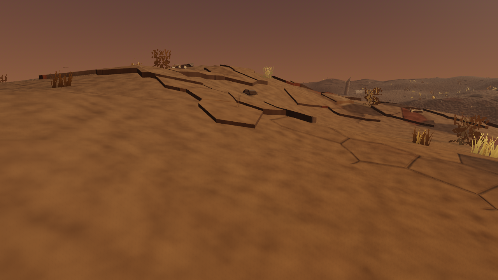
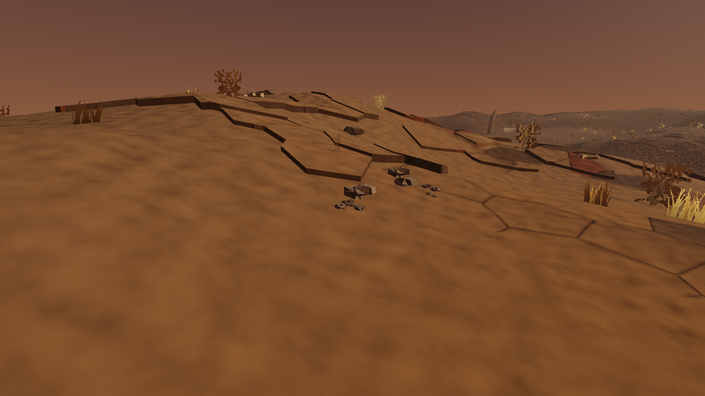
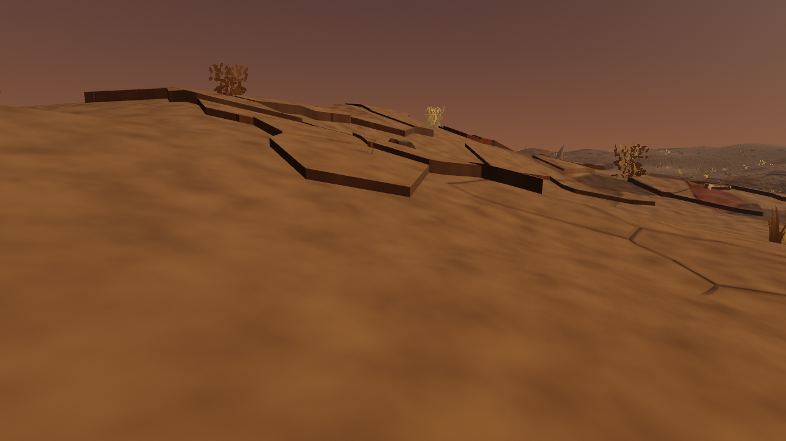
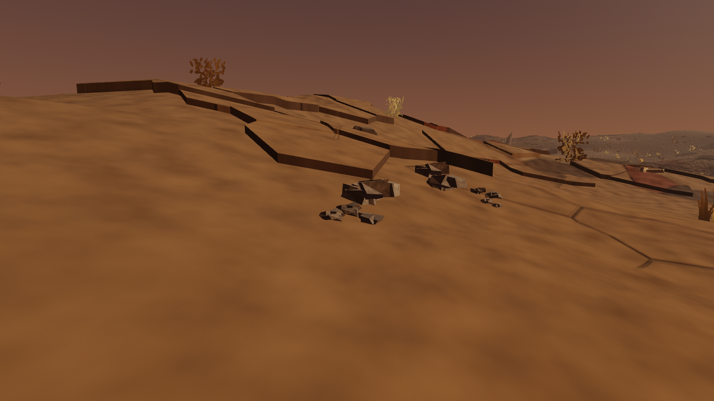

> 🤖 Generated by the Agentic Engineer

# Chips and grit at slab edges (#549)

These raw, ungraded 1280×720 frames boot the actual launch scene with world seed 1409,
Godot 4.7.1 and Metal Forward+. The existing `WAR_GROUND_PLATES=1` preview is
enabled throughout the comparison. Only its new cosmetic rubble batch is
hidden and shown; the raised stone, terrain and shipping atmosphere remain.
Character, vault and recovery saves use distinct disposable paths.

| View | Rubble hidden | Rubble visible |
|---|---|---|
| Walking |  |  |
| Grazing |  |  |

## Source and controls

The camera targets accepted fragments from actual built slab `(1409, 22, 6)`,
edge 0, from `(26.6594, 7.9510)` to `(26.0557, 7.7935)` in the ground plane.
Its outward ash-cover sample is 0.9757. The instrument deterministically selects
an elevated apron outside the recorded ash-pool footprints, then pins the
authored drift phase after the real camera receives its atmosphere update.
It does not disable the shipping fog or change runtime placement.

The initial nearest-origin vantage was unusable inside a low, dense ash pool:
only 0.0015% of pixels changed. It was rejected; the threshold was retained.

The world contains **192 aprons and 1,148 cluster instances** in one opaque,
unshadowed MultiMesh, below the **192/1,152** hard caps. Each reused cluster
contains four chunks. Each placement roots on the original terrain; its full
mesh footprint, including scale and every rotation, stays clear of intact tops
and the protected cave, shrine, ruin and doorway approaches. Every accepted
apron retains larger lip chips and finer outward grit. These protections do not
claim a general path network that the current world does not have.

| View | Pixels changed at luma step 0.02 | Repeat/restore control | Draw calls, hidden → visible |
|---|---:|---:|---:|
| Walking | 0.3503% | 0.0000% | 211 → 212 |
| Grazing | 0.9909% | 0.0000% | 162 → 163 |

The [report](report.json) is reproduced exactly in a
[second independent game boot](fresh-boot-report.json): source identity, edge,
placement/apron counts, cameras, changed-pixel fractions and draw counts agree.
This is layout and measured convergence, not byte-identical temporal-rendering
pixels. Raw repeat and restore PNGs are retained for both views, together with
the [whole-treatment opt-out control](plates-off.png).

Native placement and world tests separately hold reordered-input and process-RNG
independence, real source provenance, keep-outs, lazy/fresh/live convergence,
exact batch reuse and unchanged terrain, solid plate and original foliage
records. The existing raised mesh remains at fingerprint `3b10ac9827bd44b8`,
3,438 tops, 190,436 vertices and 116,759 triangles. The budget instrument's
shader-only arm excludes both raised stone and rubble; its full-on arm includes
both. No GPU budget is inferred from these draw counts.

## Reference, judgment and remaining gap

The viewed reference is the official
[Fatekeeper media gallery](https://fatekeeper.thqnordic.com/), screenshot 09:
damaged masonry meets uneven stone and soil patches beside a readable paving
route. Its varied sizes, grounded material and contact shadows make the
transition convincing. The reference is view-only; no third-party pixels or
game assets were downloaded, committed or used as a generator input.

Before, the slab has a continuous hard boundary against otherwise bare ash.
After, larger angular chips sit below the lip, with smaller grit further out.
The shape follows that edge and leaves broad ash gaps instead of decorating
the whole field. This is a visible improvement to the weathered transition
requested by #549.

The reused cluster silhouette still repeats, contact shadows are absent, and
the ash/stone surfaces remain smooth and visually uniform compared with the
reference. Regional exposure (#550), measured GPU activation (#548), the parent
stone-material target (#272) and Phase 0 taste acceptance remain open. This
delivery does not activate the preview or claim that the larger art target is
met.

## Originality and provenance

- Abstract target: a generic scale transition from a fractured stone edge to
  fallen chips and finer grit.
- Independent choices: World at Ruin's own built polygons and ash samples,
  integer edge-local variation, ranked bounded selection, protected landmark
  approaches and the existing procedural rubble art.
- Excluded expression: no reference map, masonry layout, palette, material,
  prop silhouette, character, text or narrative was reconstructed.
- Inputs: first-party GDScript geometry and generated `FoliageArt` only; no new
  runtime art assets. The nine first-party capture PNGs are exact-byte-bound in
  `docs/first-party-captures.sha256`.

## Reproduce

Use an owned absolute directory and three distinct absolute save paths:

```sh
rtk proxy env WAR_GROUND_PLATES=1 WAR_PLATE_RUBBLE_SHOT_DIR=/private/tmp/war-rubble-shots \
  WAR_SAVE_PATH=/private/tmp/war-rubble-shots/character.json \
  WAR_VAULT_PATH=/private/tmp/war-rubble-shots/vault.json \
  WAR_BOOT_RECOVERY_PATH=/private/tmp/war-rubble-shots/recovery.json \
  godot --path client --resolution 1280x720 res://tools/plate_rubble_capture.tscn
```

The capture must print `BOOT_OK` and `TEST PASS`; headless mode, missing save
isolation, absent source rubble, an invisible change, unstable controls or more
than one additional draw call fail it.
