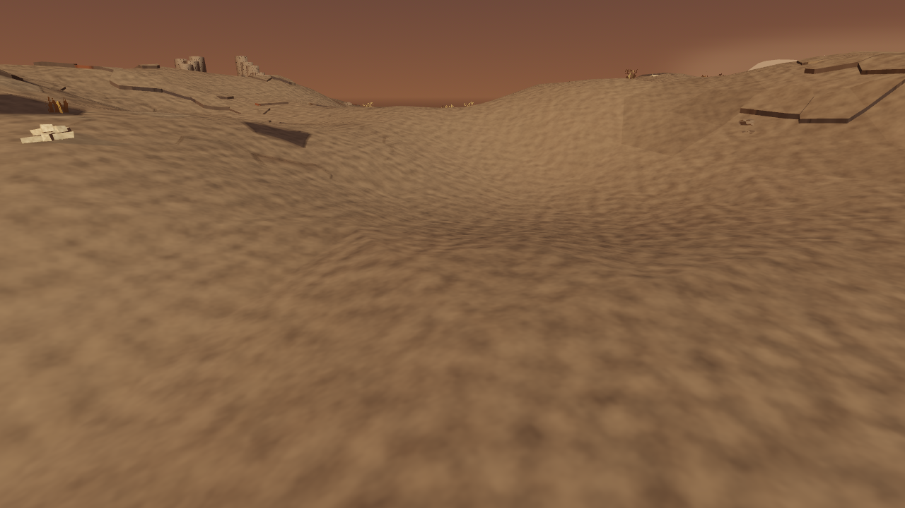
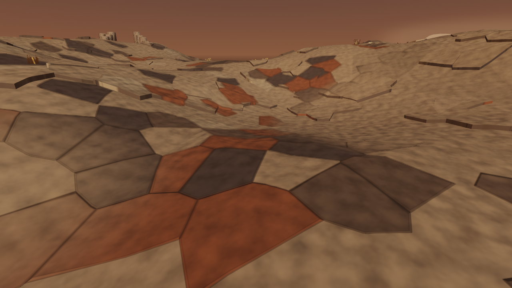
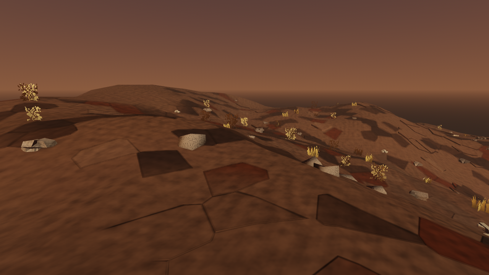
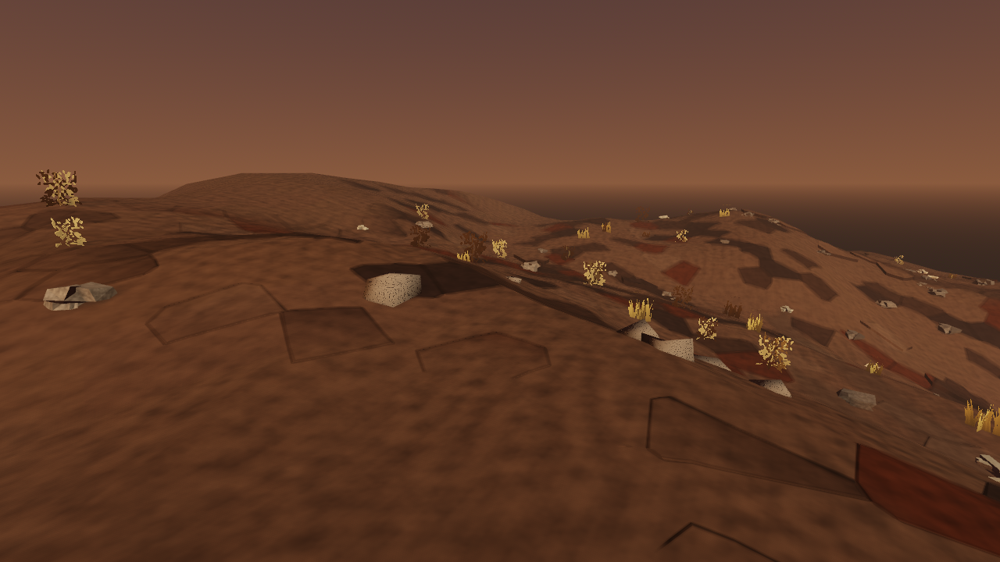

> 🤖 Generated by the Agentic Engineer

# Regional exposed stone (#550)

These raw 1280×720 frames use the actual launch scene, seed 1409, Godot 4.7.1
and Metal Forward+ on Apple M2 Pro. Shipping volumetrics and the six ash pools
remain enabled. Character, vault and recovery saves use three distinct
disposable paths. Both comparison arms have `WAR_GROUND_PLATES=1`; only the
regional profile changes in the same build.

| Fixed view | Global profile | Regional profile |
|---|---|---|
| Bonepale |  |  |
| Cinderreach |  |  |

## Measurement and controls

The authored profiles blend exposure and slope thresholds over the existing
nine-metre regional band. Bonepale exposes broader patches; ashflats buries
more stone. The profile does not change slab identity, substance, cell layout
or thickness, and the geometry still builds each identity at most once.

| Region | Built tops, global | Built tops, regional |
|---|---:|---:|
| Ashflats | 1,494 | 228 |
| Cinderreach | 527 | 387 |
| Bonepale | 611 | 1,321 |
| Rustmoor | 806 | 270 |

These counts classify each built slab by its site. They are not comparable
area percentages: regions occupy different amounts of the world. A separate
native world regression divides actual built tops by eligible slab candidates
inside fully decided region interiors and requires scoured Bonepale's coverage
to exceed buried ashflats by more than two times.

| View | Camera XZ → target XZ | Pixels changed at luma step 0.02 | Repeat/restore floor |
|---|---|---:|---:|
| Bonepale | (-68, -2) → (-72, -4) | 43.8879% | 0.0000% |
| Cinderreach | (-86, -69) → (-92, -74) | 8.6461% | 0.0000% |

The capture fixes a 60-degree field of view and puts the eye 1.7 m above the
original terrain, targeting 0.05 m above it. It quiets actors and HUD and pins
the scenery and shipping ash-pool animation phases. The vantages are committed
and checked to stand in their named regions. No camera, lighting or atmosphere
changes between arms. The change must exceed both 0.5% of pixels and twice its
unchanged-control floor. A plates-off regional/global comparison changes
0.0000% of pixels. Failed image writes or failed controls cannot report success.

The [report](report.json) and [fresh-boot report](fresh-boot-report.json) retain
the measurements. Two independent boots reproduce the exact region counts and
cameras, with zero repeat, restore and plates-off floors. Temporal rendering
pixels are not claimed byte-identical across processes. The raw control frames
remain alongside the displayed comparisons, and every committed capture is
bound in `docs/first-party-captures.sha256`.

The complete 181-scene client suite passed. Additional native tests hold fresh
and live geometry/rubble equality, cave material rebuilds, malformed regional
flags, regional-only boot fallback and unchanged terrain/foliage. The six-point
native GPU probe transports the blended profile within one RGB8 quantum
(maximum channel error 0.001960814). It is not a full exposure cutline parity
or performance acceptance result.

## Reference, judgment and remaining gap

The viewed reference is official [Fatekeeper screenshot 02](https://fatekeeper.thqnordic.com/game-sites/fatekeeper/content/screenshots/screenshot-02.png)
from its [media gallery](https://fatekeeper.thqnordic.com/): broken stone and
covered earth remain distinct within irregular patches along the walking path.
The abstract target is place-specific exposed stone with a believable transition
into covered ground. The reference was viewed only; no reference media or game
assets enter this repository or the rendering input.

Bonepale now reads as substantially more scoured than the global arm at the
same vantage; Cinderreach has a sparser stone field. The difference is visible
immediately in these paired views. The stone still looks tiled, wear is weak,
contact shadows are absent and warm haze flattens material separation compared
with the reference. This is a useful coverage experiment below the art target,
not maintainer taste acceptance.

`WAR_REGION_STONE` remains default-off and requires the existing default-off
plates preview. Parent material work #272, raised-stone GPU activation #548
and Phase 0 acceptance remain open. #1287 owns this preview's decision and
retirement; its review date is 2026-11-07.

## Originality and provenance

- Abstract target: irregular bare-stone coverage that reflects local burial
  and scouring, with smooth regional transitions.
- Independent choices: four original Reach profiles; seed-derived first-party
  slab cells and closed lips; original ash/rock palette and landforms; edge
  rubble gathered from the world's own polygons; the burned open landscape
  and shipping orange haze.
- Excluded expression: no reference forest layout, sword, character, prop,
  material texture, map, wording or narrative is reconstructed.
- Inputs: first-party GDScript and procedural shaders only. The ten PNGs are
  original captures of this source tree; no new third-party runtime art.
- Remaining risk: generic procedural polygon repetition still needs artistic
  refinement. This record does not claim the wider world already clears its
  originality or art gate.

## Reproduce

Choose an owned absolute directory and distinct save paths:

```sh
rtk proxy env WAR_GROUND_PLATES=1 WAR_REGION_STONE_SHOT_DIR=/private/tmp/war-regional-stone \
  WAR_SAVE_PATH=/private/tmp/war-regional-stone/character.json \
  WAR_VAULT_PATH=/private/tmp/war-regional-stone/vault.json \
  WAR_BOOT_RECOVERY_PATH=/private/tmp/war-regional-stone/recovery.json \
  godot --path client --resolution 1280x720 res://tools/region_stone_capture.tscn

rtk proxy godot --path client res://tools/region_stone_shader_probe.tscn
```

Both tools must print `TEST PASS`; the capture also requires `BOOT_OK`.
Headless rendering, missing save isolation, invisible change, unstable controls
and image-write failure are refusals. The profile probe uses an 8×8 native
viewport and does not need game saves.
