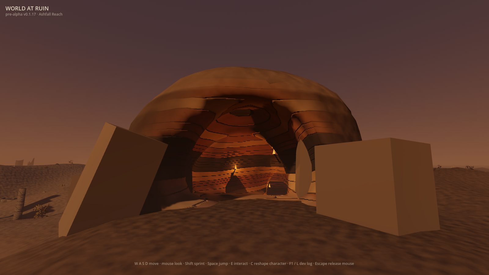
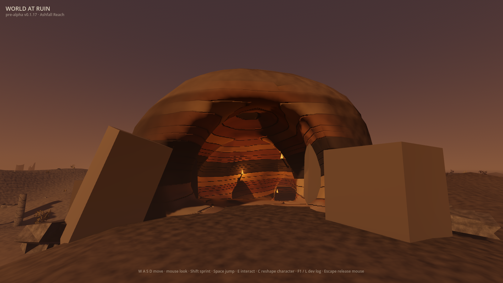

# Cave-foot talus (#558)

Fixed-vantage evidence for the default-off `WAR_CAVE_FOOT_TALUS` treatment.
These are raw, ungraded 1600×900 frames from the shipping world, held to the
committed `cave-mouth` camera in `client/tools/frame_capture.gd`.

| Flag off | `WAR_CAVE_FOOT_TALUS=1` |
|---|---|
|  |  |

Both runs used Godot 4.7.1, Metal Forward+, seed 42, the same character recipe
and redirected disposable save, vault and boot-recovery paths. Each emitted
`BOOT_OK`, passed all eight capture vantages and reported the same derived
cave-mouth camera:

```text
eye (-32.46, 1.81, -11.59) -> target (-41.87, 3.15, -14.95), ground 0.11
```

`frame_diff.gd` measured **1.75% of cave-mouth pixels changed**, mean absolute
RGB delta 0.0021 and maximum channel delta 0.3882. The interior
`cave-walkout` control moved 0.00%, which localises the visible change to the
outside cave foot rather than the cave hull or camera.

## Reference and reading

The abstract brief is the repository's
[structures, caves and blending target](../../art-direction/README.md#structures-caves-and-blending-225):
broken material should leave scree and cave walls should carry debris skirts
instead of ending in a bare mesh-to-ground line. Its named influences are
[Elden Ring's official world presentation](https://en.bandainamcoent.eu/elden-ring/elden-ring)
and Blizzard's official
[Fractured Peaks guide](https://news.blizzard.com/en-us/article/23916442/your-guide-to-the-diablo-iv-open-beta).
They are link-only references; no third-party media entered this repository or
the generation path.

The off frame has two large entrance slabs meeting the ground with no
intermediate scale. The on frame gathers smaller angular heaps outside both
slabs. Their uneven extents break the hard foot silhouette, while the centre
approach and view into the torch-lit bore remain unchanged.

## Remaining gap

This is only the loose-stone layer. The generated massif still reads smoother
and more curved than the target's planar broken rock, and neither frame gains
drifted ash, dirt buildup or returning vegetation at the seam. The treatment
therefore remains default-off pending the taste decision tracked by #563.

## Originality

- **Abstract target:** a generic gravity-made debris skirt that visually joins a
  rock mass to the ground it stands on.
- **Independent choices:** derive sites from World at Ruin's own generated
  terrain-contact triangles; preserve a wide central mouth corridor; use one
  asymmetrically seeded field of four-piece procedural rubble clusters; bias
  only the approach-facing fringe outward so the committed player-height camera
  can judge it.
- **Excluded reference-specific expression:** no map, ruin layout, cave
  composition, palette, material, prop silhouette, name, text, character or
  narrative element from either named title was reconstructed.
- **Inputs and provenance:** first-party GDScript geometry and the existing
  generated `FoliageArt` rubble mesh/material only. The two tracked PNGs are
  first-party captures bound in `docs/first-party-captures.sha256`.
- **Remaining similarity risk:** low at the individual talus-layer level because
  fallen rock at a rock foot is generic; the complete cave composition still
  requires the normal human taste and originality review before the flag is
  retired.
