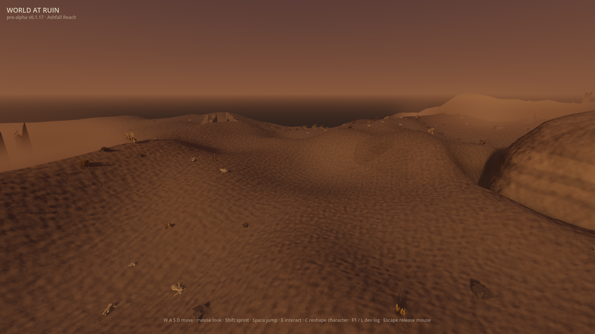
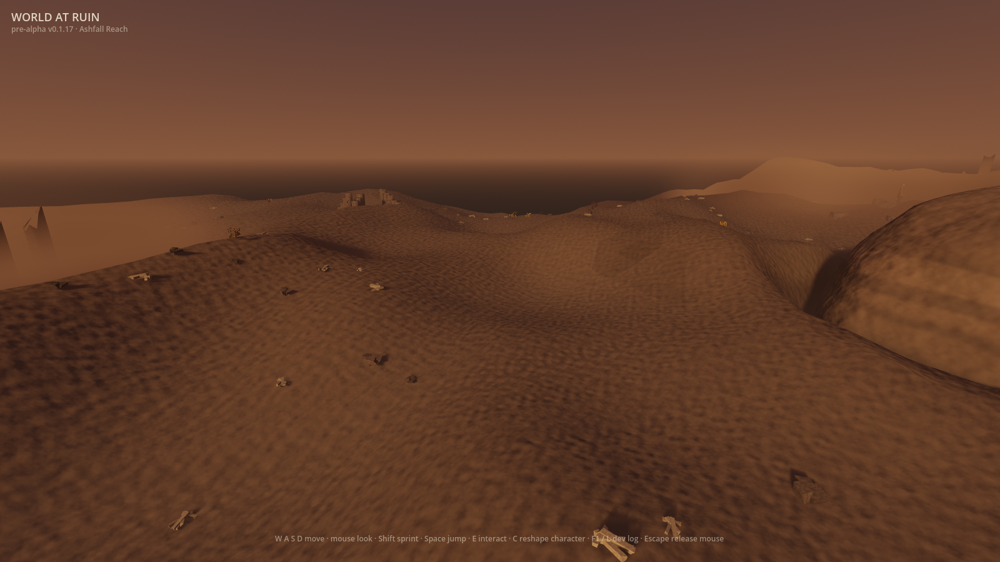
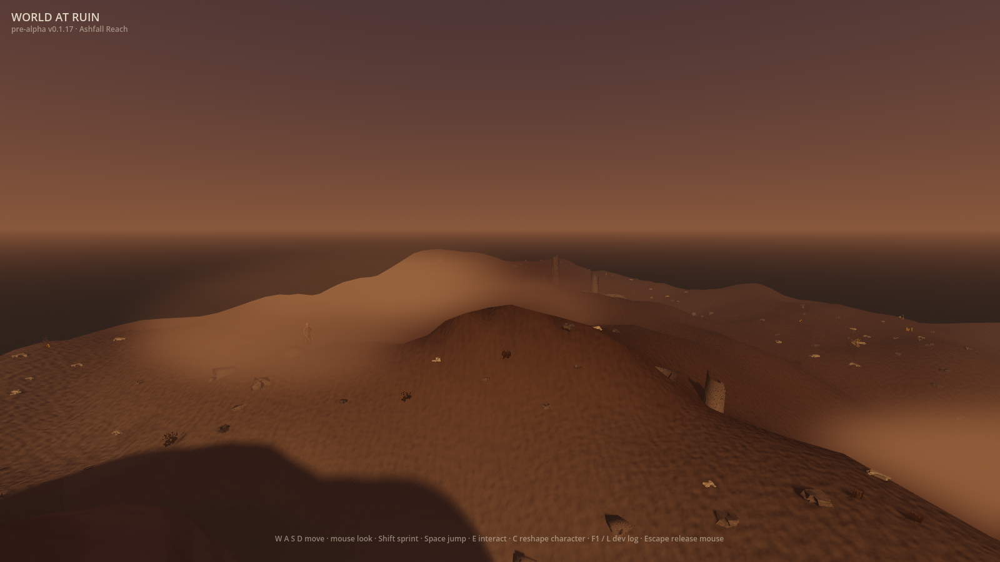
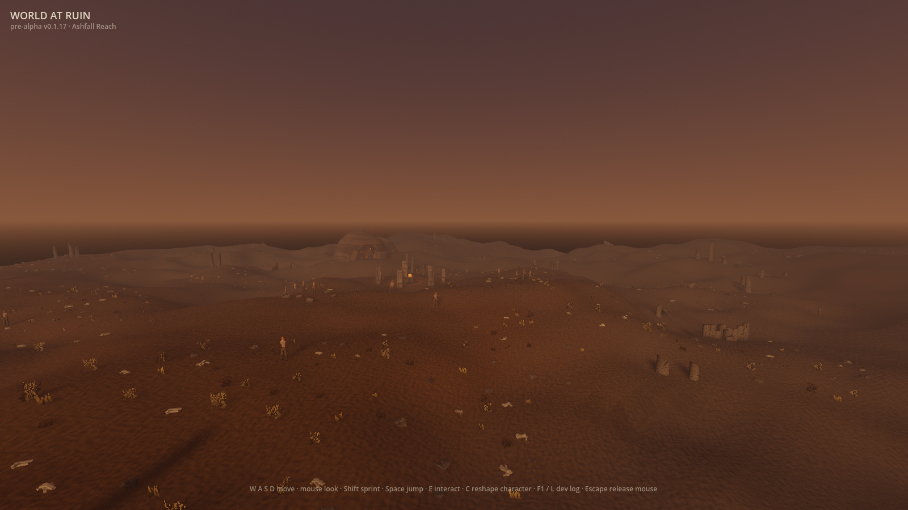
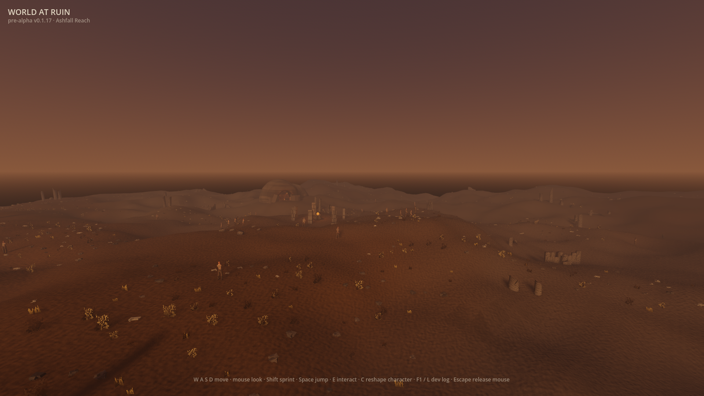

# Region-authored foliage (#612)

Fixed-vantage evidence for the default-off `WAR_REGION_FOLIAGE` treatment,
captured after rebasing onto `v0.75.0`. These are raw, ungraded 1600×900 frames
from the shipping world and the committed `bonepale`, `cinderreach` and
`crossfield` cameras in `client/tools/frame_capture.gd`.

| Vantage | Flag off | `WAR_REGION_FOLIAGE=1` |
|---|---|---|
| Bonepale |  |  |
| Cinderreach |  |  |
| Crossfield |  |  |

Both runs used Godot 4.7.1, Metal Forward+, world seed 1409, the same character
recipe, and redirected disposable save, vault and boot-recovery paths. Each
emitted `BOOT_OK` and passed all eight standard capture vantages.

`frame_diff.gd` compared the two states: **3.26% of crossfield pixels changed**
(mean absolute RGB delta 0.0020, maximum channel delta 0.5059), **1.35% in
Bonepale** (0.0015, 0.4824), and **1.20% in Cinderreach** (0.0011, 0.5294).
The cave-chamber control moved 0.00%; the visible change stays on regional
ground cover rather than the camera, cave interior or player.

## Reference and reading

The abstract brief is the repository's
[World and terrain target](../../art-direction/README.md#world-and-terrain-226):
locations should be distinguishable in one frame and regions should transition
rather than end at ownership seams. Its primary conceptual reference is
[Numenera's Ninth World](https://numenera.com/), where local character follows
what happened in a place instead of one terrain noise describing everything.
The reference is link-only; no third-party media entered the repository or the
generation path.

The off frames distribute the same shrub, grass, bone and rubble tendencies
through all three views. With the preview enabled, Cinderreach loses most bright
living cover and reads as exposed burnt high ground; Bonepale sheds scrub and
grass in favour of pale remains and stone; crossfield shows the fixed prop
budget redistributed into denser and sparser regional passages. The existing
region shares make those decisions fade continuously at boundaries.

## Remaining gap

The profiles make the four existing generated prop kinds carry more local
meaning, but they do not add new silhouettes or materials. The treatment also
has not cleared its human art decision, and Ashfall Reach still lacks the
target's colossal inherited landmark. It therefore remains default-off until
the explicit retirement decision in #613.

## Originality

- **Abstract target:** distinguish adjacent wasteland regions through local
  density and prop-family composition without visible boundary seams.
- **Independent choices:** keep Ashflats byte-identical as the reference;
  make burnt high ground sparse and rubble-led; make scoured pale ground favour
  bone and stone; shelter dense scrub in the low rusted moor; blend every knob
  through World at Ruin's existing multi-region shares while preserving one
  global prop budget.
- **Excluded reference-specific expression:** no named region, map, landmark
  composition, palette, prop silhouette, material, terminology, narrative or
  text from Numenera or any supporting analogue was reconstructed.
- **Inputs and provenance:** first-party GDScript, World at Ruin's existing
  generated foliage meshes/materials, and first-party captures bound in
  `docs/first-party-captures.sha256`; the external reference remained
  link-only.
- **Remaining similarity risk:** low for the individual regional-scatter rule
  because weighted environmental distribution is generic. The whole zone still
  needs the normal human taste and originality review before the flag is
  retired.
