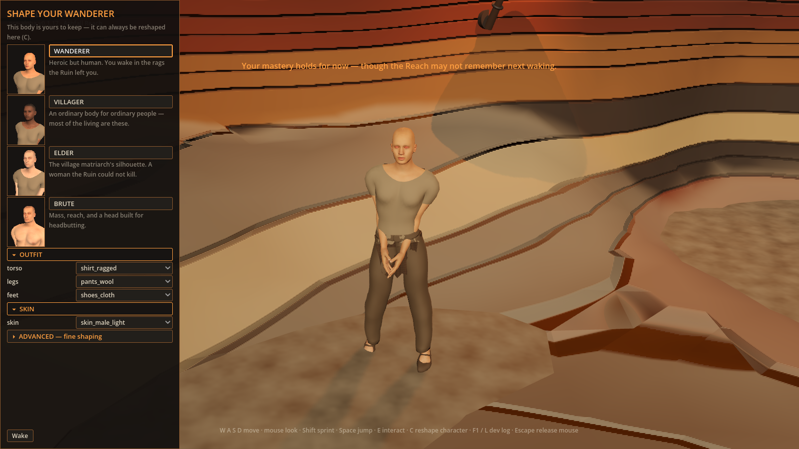
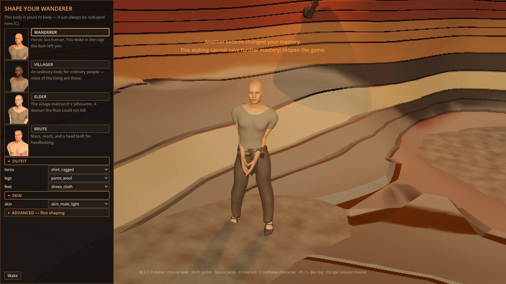

# Mastery persistence evaluation

Evaluated on 2026-09-30 against main `abcbc625e9728ec4b68299c038f1c9fc1eb7c503`.

The four new scenes exercise complete snapshot publication, original-byte guarded
replacement, a real foreign-process lock, and abrupt process loss. The reviewed
base's 137 scenes additionally exercise actual Main ownership, frame retries,
clean exit, reboot, full old-state preservation, retry cap/reset, permanent
stale-session fencing, and temporary-to-conflict HUD escalation.

Before activation, the snapshot, writer and foreign-lock scenes fail because the
production writer is absent. With activation all four new scenes pass. Disposable
negative controls passing `IDENTITY_UNCHECKED` to replacement or removing the
outer lock fail the new identity and whole-transaction assertions respectively.
The inner replacement lock cannot conceal the missing outer lock.

The real second Godot process advances unrelated quest progress and holds the
vault lock. Contention leaves vault bytes and that process's ownership unchanged,
and does not enter mastery comparison or guarded replacement. Recovery uses the
same pending owner, preserves the foreign progress, and commits coalesced awards
once. Every process uses inherited isolated save paths; the runner supervises its
whole process group.

The immutable retained v0.93.1 whole-app reader and exact boundary fixture are
documented in [the retention evidence](../issue-658-mastery-retention/README.md).

## Actual save notices

These frames come from Main's actual persistence failure signal and HUD at the
shipped 1600×900 viewport. The capture mutates its isolated ledger, induces a real
storage refusal, then changes saved mastery before the retry. It also asserts
that the player's three real save files remain untouched.





Reference: the game's existing ember-colored HUD toast and the UI/UX hierarchy
target in [art direction](../../art-direction/README.md#ui-and-ux-227). The two-line
conflict notice fits clear of the character panel and states the recovery action.
This is an in-place save-feedback change. The surrounding creator remains below
the declared framed-panel/material quality target; its replacement is #227.
No third-party artwork or reference media was used.

Reproduce from the repository root with the matching official Godot engine:

```sh
godot --headless --editor --quit --path client
godot --path client --script "$(pwd)/docs/evidence/issue-658-mastery-persistence/capture_warning.gd"
```

The script writes `/private/tmp/war-658-temporary-warning.png` and
`/private/tmp/war-658-conflict-warning.png`, then prints `CAPTURE OK`.

## Delivered scope

The production owner persists real ledger transitions and exposes failures. No
current gameplay caller awards mastery or initiates death/reclaim operations;
those interactions remain separate work. This evaluation does not claim a
playable combat progression loop.
