# Bare stone and glancing uphill crossings (#895, #896)

The raised-stone treatment remains default-off behind `WAR_GROUND_PLATES=1`.
This pass removes foliage centres inside its built polygons and fixes angled uphill
approaches without increasing the step height, floor limit or travel budget.

## Close foliage comparison

Both frames use the same seed, viewpoint, lighting and original shrub position.
The before frame shows the shrub rooted through the foreground slab. After,
the solid top is bare and cover remains in the surrounding ash.

| Before | After |
|---|---|
| 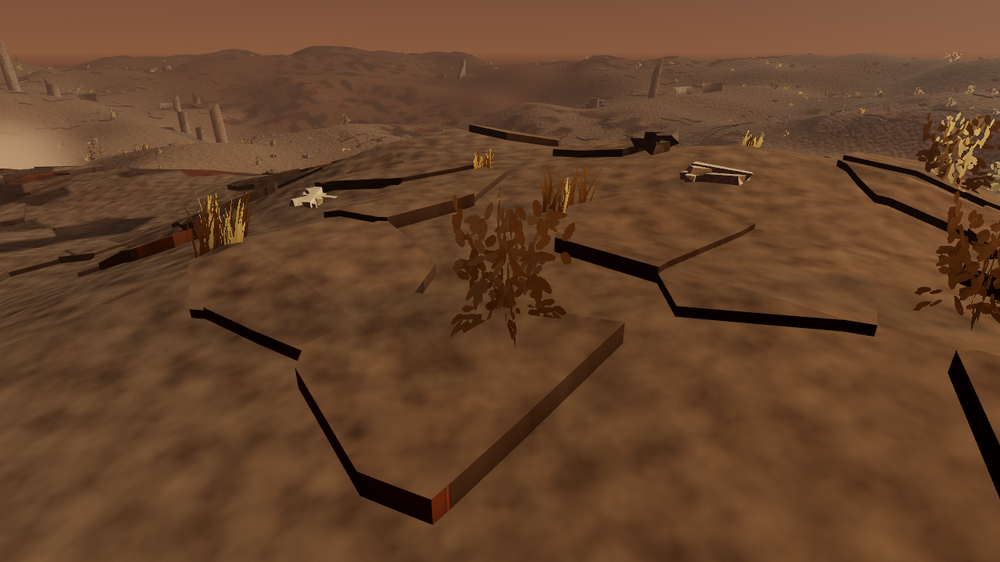 | 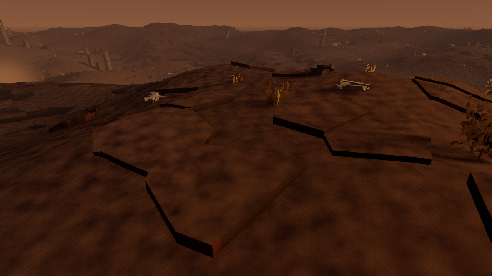 |

The independent polygon test finds **254 overlaps among 2,400 original placements**.
All 254 are excluded; the remaining 2,146 keep their stored transforms and traits.
Turning the preview off restores all 2,400 exact placement records and visible
instances. Fresh opted-in boots agree with live toggles.
The generated-placement inventory and existing foliage nodes remain stable across
the preview; a separate visible-placement copy reports the submitted subset.
Repeated toggles reuse the original lifted transforms without adding height.
Compacting instance IDs can change the preview's shader tint and gust phase; those are not stable-placement
claims. The base terrain, collision, slab geometry and opt-out scatter goldens remain
unchanged. Compare the earlier [raised-top frame](../issue-547-ground-plate-geometry/close-on.png).

## Actual controller sequence

This is the shipped `Player` driving the shipped Wanderer body through the real
booted world, not fixed gait poses. Each row names a controller tick at 60 Hz.
The same 45° uphill approach meets the same lip at `(51.09569, -73.95025)`.
Before, the body slides along the edge and misses the stone. After, it crosses the
raised side and comes to rest on the top.

| Tick | Before | After |
|---|---|---|
| 0 | 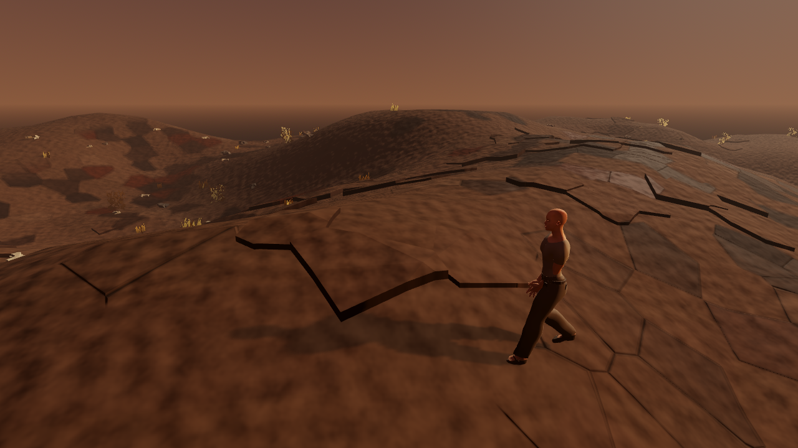 | 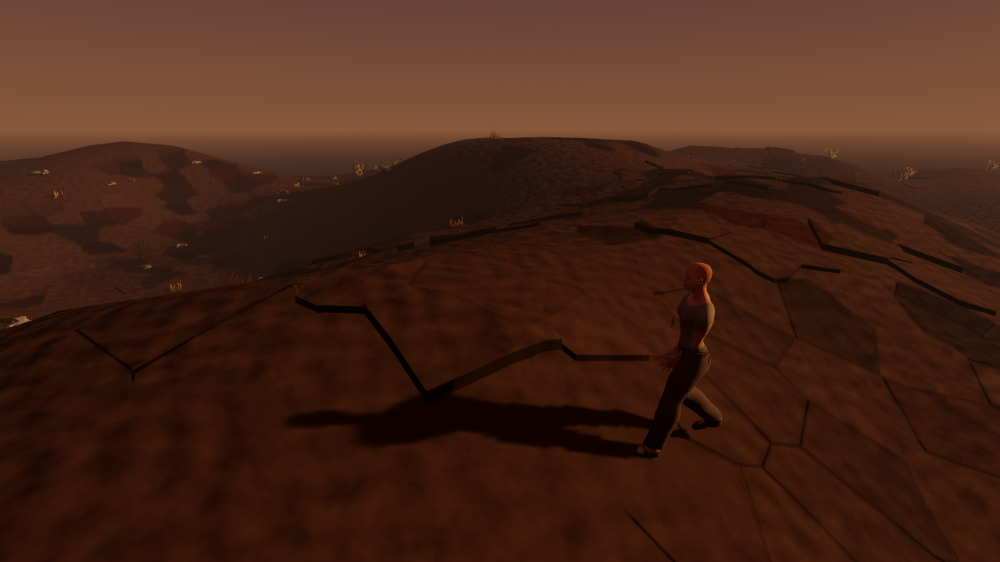 |
| 12 | 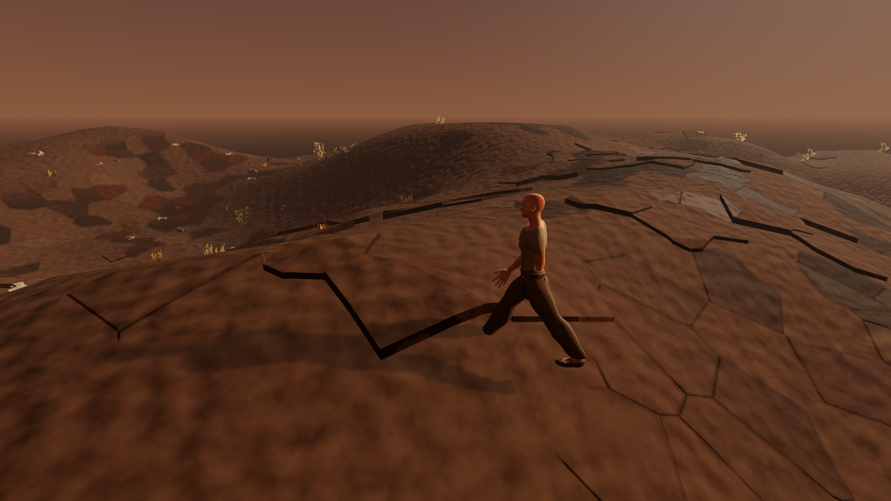 |  |
| 24 | 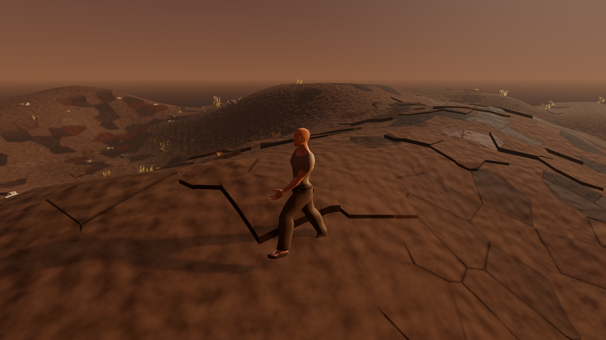 | 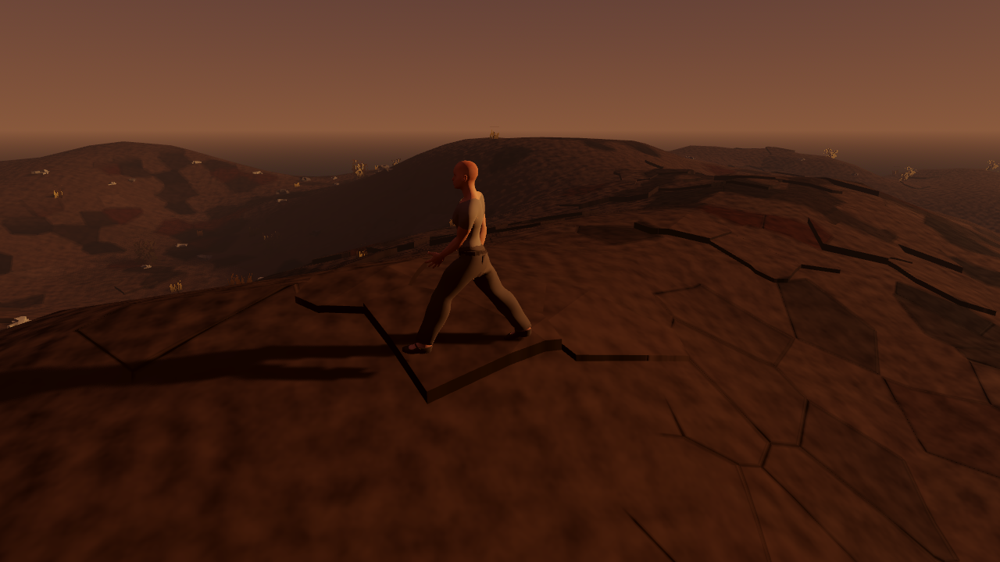 |
| 36 | 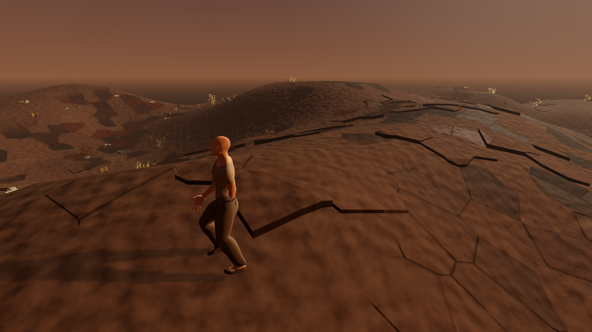 | 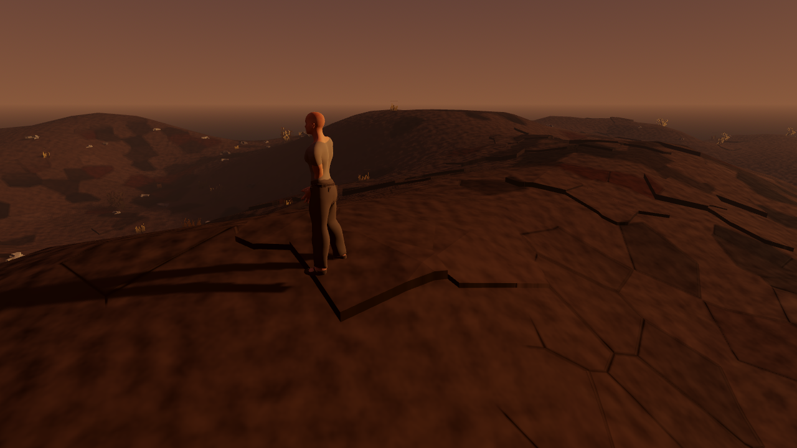 |
| 48 | 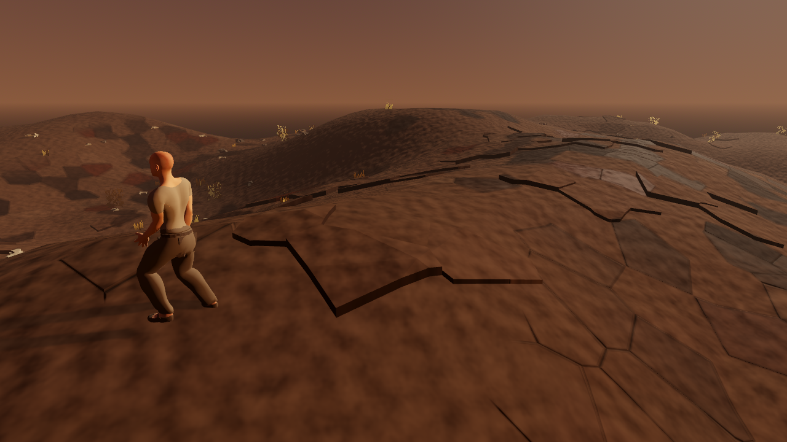 | 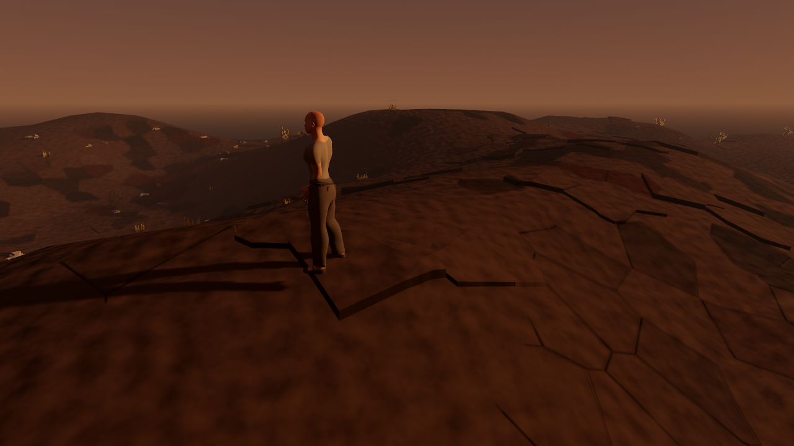 |
| 60 | 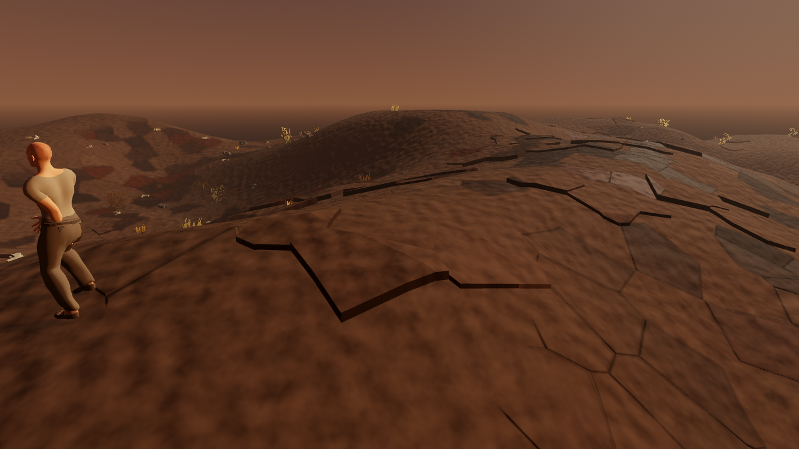 | 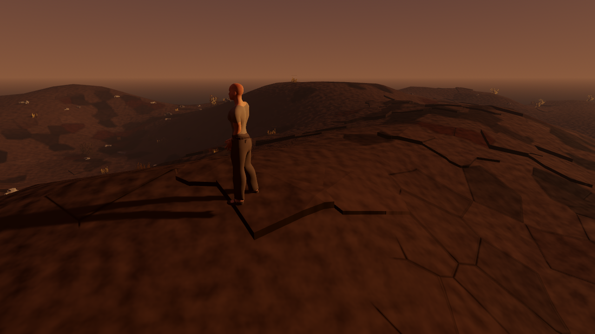 |
| 69 | 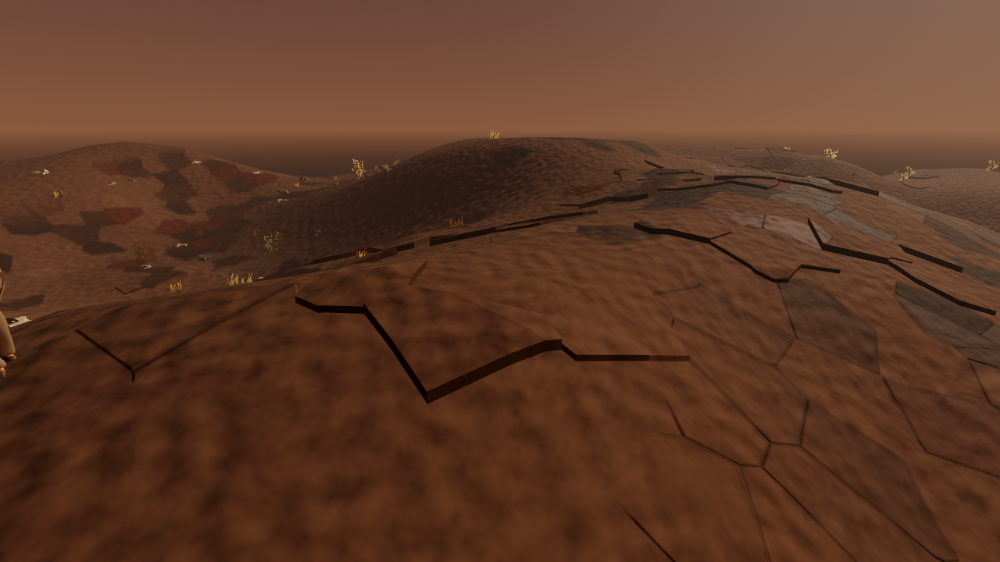 |  |

[Before trace](before.csv) and [after trace](after.csv) retain all 72 ticks.
The capture releases input only on arrival; before continues walking because it
never arrives. Roaming NPCs and creatures are removed from the capture to isolate
the terrain crossing, matching the physics census. Generated terrain, slabs,
collision, lighting, actual controller and owned character rig remain intact.
There is no evidence here of multiplayer traversal or movement among live traffic.

## Physics evidence

The **unchanged** `plate_crossing_sweep` samples 60 built lips at least 10 cm thick,
with clear approaches, at walking and sprint speed. Counts include both speeds.

| Controller | Total stalled | 90° | 45° | 25° |
|---|---|---|---|---|
| No step, both builds | 110/262 | 43/88 | 37/94 | 30/80 |
| Previous 0.24 m step | 12/262 | 0/88 | 6/94 | 6/80 |
| Current 0.24 m step | **0/262** | **0/88** | **0/94** | **0/80** |

Both ordinary timing and fixed-60-FPS baseline runs reproduce the prior counts.
The new regression exercises 14 clear paths at three literal previously failing
lips, requires the capsule centre to cross onto the actual raised side and verifies
settled floor support. The existing `ground_plates_physics_test` remains unchanged
and passes its full collision census, head-on, descending, neighbour and triple
junction crossings, determinism and plain 22° ramp checks.

Steps spend only the held input's earned acceleration budget. Every alternative
is a body-swept lift, same-length planar stride and drop from the same origin;
all floor-angle, rise, forward-gain and standing-plane ledge guards still apply.
New behavioral controls reject unearned travel from rest, carrying a previous
heading's budget around a wall, climbing a one-metre wall, and stepping beneath
insufficient headroom. Independent review found another case: a released-input
interval followed by a perpendicular step used old forward momentum. Its actual
controller regression was RED before projecting retained momentum onto the new
heading and GREEN afterward. Continuous four-degree heading corrections now retain
projected stride rather than repeatedly restarting acceleration. A physical 0.4 m
walk-off control turns only after both engine floor and step support are lost;
five airborne ticks previously added 15.417 mm of unearned step travel. Applying
air-control acceleration during unsupported intervals reduces that excess to zero.
A respawn-with-held-input control also exposed retained pre-teleport stride after
physical velocity was cleared; resetting both history fields removes that excess.
All earlier wall, ceiling, release and from-rest controls still pass.
The opt-out controller remains unchanged.

The actual-controller `gait_drive` instrument also rendered 24 frames and measured
170 controller steps with the slab flag off and on. Both traces have fingerprint
`6a2040a2d1212899dac0b5ab8288833ed9e85d174a6ed48fb7d64364c31909ff`:
ordinary-ground motion is unchanged. Walk remains 6.00 m/s, run 10.49 m/s; a down
foot moves at 6% and 5% of body speed respectively, with down-foot coverage 52%
and 19%. These are bounded measurements of that instrument, not a foot-quality
clearance for the instant lift over a lip.

The 171 client regression scenes passed during this work, with the eleven
affected scenes repeated after the final input-history correction. Editor import,
real windowed boot, GDScript lint and its negative policy control, and the
originality guard pass. The server remains byte-identical to the base: formatting,
vet, pinned lint, build and both vulnerability scans pass. Its complete native
race suite passes in an isolated official Go 1.27.1 Linux container. On the Mac,
the allocator transport tests encounter a separately reproduced private-address
socket-delivery failure; no test, transport guard or host policy was weakened.

## Reproduce

Godot `4.7.1.stable.official.a13da4feb`, Apple M2 Pro, Metal Forward+, 1280×720,
shipping volumetrics. No third-party asset or reference media is in these frames.
The before project uses exact base `6dd9c35dc7529d11bf1b8dbb7c18ba910465159e`
player/world scripts and the same capture instrument as after.

SHA-256 of the captured sources:

| Source | SHA-256 |
|---|---|
| Player | `ad6c34e04b21ed328019fcf74bc53a01ad48770f3b766be437f7e62de1de448a` |
| World generation | `1d4a6d214f96131254f10d87c59137e443bba946ec24877490af31778d64667e` |
| Capture instrument | `4e3ec4eaf16f2141f7c27b2baaf33b5a1f43b450dc1a72f4e73936e46462e248` |
| Unchanged crossing census | `126fde7a1e40425679445cb53529c1ed24a9a5ae4e2aecb24fc83f1994fcf84b` |

```sh
godot --headless --path client res://tests/ground_plate_foliage_test.tscn
godot --headless --path client res://tests/ground_plate_glancing_test.tscn
godot --headless --path client res://tests/player_step_budget_test.tscn
godot --headless --path client res://tests/ground_plates_physics_test.tscn
godot --headless --fixed-fps 60 --path client res://tools/plate_crossing_sweep.tscn

WAR_GROUND_PLATES=1 WAR_WALK_CYCLE=1 WAR_RUN_CYCLE=1 \
WAR_SCENARIO=slab_crossing WAR_SHOT_DIR=/tmp/war-slab-shots \
WAR_SAVE_PATH=/tmp/war-slab-character.json \
WAR_VAULT_PATH=/tmp/war-slab-vault.json \
WAR_BOOT_RECOVERY_PATH=/tmp/war-slab-recovery.json \
godot --path client --resolution 1280x720 res://tools/frame_capture.tscn
```

The capture's existing save-isolation and windowed-render guards run before boot.
Its 24 rendered frames and complete controller trace are produced through the
ordinary frame-capture entrypoint; seven unmodified frames per state are retained
here. `CAPTURE PASS` requires arrival above the walkable slab top with floor
support, followed by a supported final pose. A no-motion negative control renders
all frames but fails instead of accepting a trace that never reaches the slab.
The same no-motion trace incorrectly reports success with the reviewed instrument.
Disabling only slab collision also fails: XZ proximity over a polygon while walking
on its lower base terrain cannot establish a supported raised-top arrival.
The crossing regressions and census separately prove traversal.

## Reference, judgement and remaining gap

Moving reference: [Kingmakers — Official Announcement Trailer, 1:06–1:10](https://www.youtube.com/watch?v=OvezgDni8z4&t=66s),
the repository's approved full-body locomotion cue. The comparison is bounded to
continuous visible traversal over supporting ground; it does not establish knee,
foot-contact, weight-transfer or follow-camera fidelity. This capture uses a fixed
camera so the terrain crossing stays inspectable.

The bare slab no longer contradicts its solid material, and the corrected body
crosses the visible lip instead of sliding beside it. The step still lifts instantly,
without a knee lift or weight shift. Foot slide and the simple character/material
treatment remain below the art target. Weathered slab edges, rubble (#549), regional
exposure (#550), the broader art gate and measured GPU budget remain outstanding.
This evidence clears these two bounded defects, not the parent #548 or Phase 0
taste/performance gates. The preview stays opt-in.

## Originality

Abstract cue: uninterrupted locomotion over solid, bare stone. Independent choices:
World at Ruin's own seeded Voronoi slabs; its retained ash-cover scatter and exact
built-polygon exclusion; its capsule-swept, acceleration-bounded step; and its owned
Wanderer rig and fixed diagnostic viewpoint. No reference character, wardrobe,
terrain layout, palette, prop, animation frames or narrative expression is reproduced.
Reference media is linked for viewing only and never downloaded or used as input.
