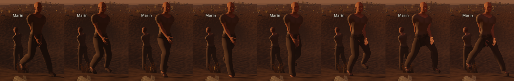
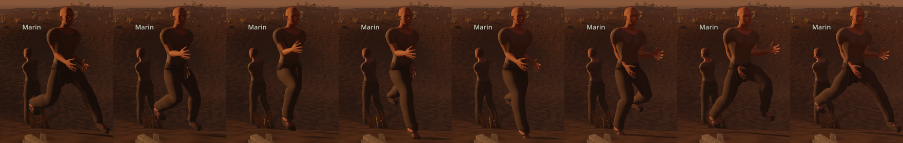
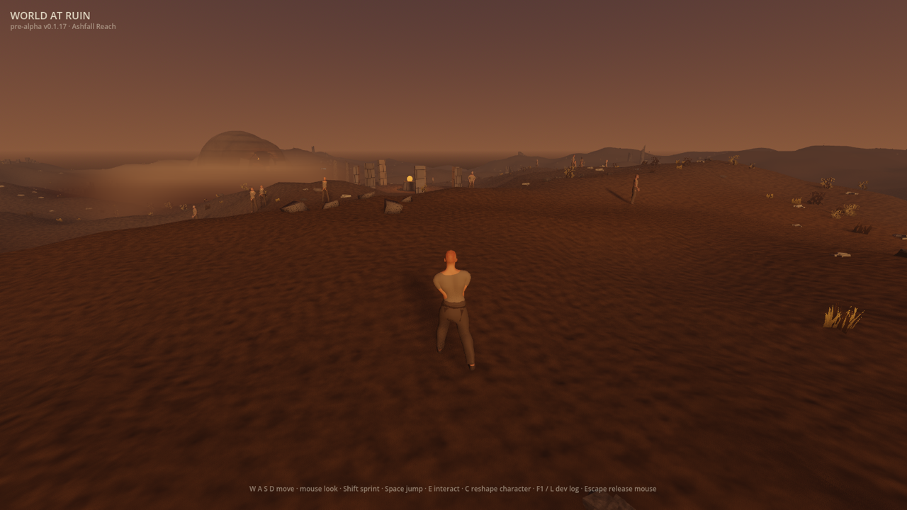
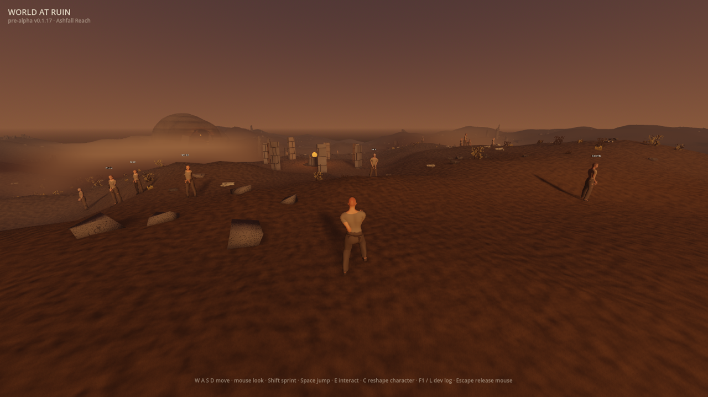

# Planted feet (#904)

Evidence that the walk and the run now hold the ground. Each leg is solved so
that a foot that is down stays where it landed while the body passes over it,
instead of swinging from the hip at a fixed angle. Part of #890.

## What changed on screen

Eight evenly spaced phases of one cycle, from `WAR_SCENARIO=walk` and
`WAR_SCENARIO=run`, cropped to the body. Frame `k` is `k/8` of the cycle. The
left foot lifts at the quarter point and the right foot at the three-quarter
point, each after being down for the stretch just before, and both gaits spend
the time between in the air. At 6 and 10.5 m/s with these strides, a leg reaches far enough to stay down
for only about a quarter (walk) and a fifth (run) of each cycle, so a flight
phase is what a planted gait at these speeds looks like. It is not a defect to
tune away.

## Measured through the real controller (2026-09-25)

`WAR_SCENARIO=gait_drive` (see [#516's evidence](../issue-516-gait-drive/README.md)
for how the drive works), with the contact line from #903. Host: Apple M2 Pro,
Metal 4.0 Forward+, Godot 4.7.1, `client/recipes/wanderer.json`.

| Gait | Cadence | A foot is down | A down foot moves at | Foot nearest the ground moves at |
|---|---|---|---|---|
| walk, before | 300 steps/min | 31% of the stretch | **127%** of body speed | 109% of body speed |
| walk, planted | 300 steps/min | 52% of the stretch | **6%** of body speed | 36% of body speed |
| run, before | 350 steps/min | 17% of the stretch | **140%** of body speed | 111% of body speed |
| run, planted | 350 steps/min | 19% of the stretch | **5%** of body speed | 48% of body speed |

"Down" means no more than 1 cm above the foot's standing height. The "down foot
moves at" column is the one to judge a planted foot by. Before, a down foot moved faster
than the body: it skated. Now it moves at a twentieth of the body's speed. The
nearest-foot figure stays well above zero only because it also charges each
flight, when the nearest foot is the one swinging forward.

Cadence and speed are unchanged, because stride length and speed are
unchanged. The trace fingerprint changes, because the feet move differently,
to `6a2040a2d1212899dac0b5ab8288833ed9e85d174a6ed48fb7d64364c31909ff`.

### How much of the time a foot is down

A leg reaches only so far, so each gait can keep a foot down for at most twice
its stance of each cycle: its geometric share. On flat ground, which is the
body's own ground plane with no terrain under it, both gaits reach it:

| Gait | A foot is down, flat ground | Geometric share | Over the drive's terrain |
|---|---|---|---|
| walk | 57.0% of the cycle | 49.5% | 52% of the stretch |
| run | 41.5% of the cycle | 37.6% | 19% of the stretch |

The flat-ground figures run above the share because a foot also counts as down
for the moment it is within 1 cm of the ground as it lifts and lands.
`planted_feet_test` holds both gaits to their share.

Over the drive's real terrain the run reads lower. The feet plant on the body's
own flat ground plane, so on a downhill stretch a planted foot hangs a few
centimetres above the ground under it and counts as lifted, while its slip stays
at 5%. How much lands on a downhill stretch depends on where each step falls: with
the sprint press advancing the phase at the switched stride instead of the blended
one, the same drive reads 26% for the run, still at 5% slip. Planting on the
terrain itself is #909, so on the drive #904 is judged by
slip, cadence and the flat-ground share, and the terrain share belongs to #909.

## The follow camera

The Wanderer's own follow camera at the end of each measured gait, from the same
drive. It holds the body framed at both speeds, and from behind the legs read
as a stride rather than a skate. At this distance whether a foot holds the
ground cannot be judged by eye; the contact line above is the measure for that.

## What the tests pin

`client/tests/planted_feet_test.gd` holds the solve to its promises on the
shipped rig, to the millimetre:

- a planted ankle stays at its standing height and moves back under the hip
  exactly as far as the body travels;
- the foot keeps its standing orientation, so a planted toe holds the ground with
  the ankle instead of sweeping it as the knee flexes;
- the breathing idle's weight shift, which rolls the pelvis, moves a planted
  ankle no more than the 2.5 mm the hip joint itself moves;
- a sprint press or release moves a planted foot at no more than 15% of body
  speed through the blend (4.1% measured);
- on flat ground each gait keeps a foot down for its whole geometric share;
- no phase of either gait moves a foot sideways;
- a foot leaves and meets the ground standing still over it;
- the running knee never straightens;
- the gaits lower the pelvis, and standing still and jumping restore it;
- a rig without the bones the solve needs keeps its jump.

`client/tests/walk_locomotion_test.gd` still holds both gaits to their earlier
laws: default-off, distance-driven, deterministic, and blending across a sprint
press without a jump in any bone.

## Ablations — deliberate wrong builds the tests must refuse

| Wrong build | What fails |
|---|---|
| The swing travels straight between the ends of contact | a foot skids at the ends of its swing: it moves at 0 instead of the stance's speed |
| Each foot's cycle is not offset to lift the left foot at a quarter phase | the feet do not lift at a quarter and three quarters of the cycle |
| The thigh turns about its own bone axis, as the swung gait did | the walk moves a foot 13.2 cm sideways, and a planted ankle sits 5.7 cm off its standing height |
| The run's reach limit raised to 0.999 | the run straightens its knee to 5.1° of flexion |
| A foot trailing past the leg's reach is not lifted instead | the run straightens its knee to 1.8° of flexion |
| The jump keeps the gaits' lowered pelvis | the jump is posed from a lowered pelvis |
| A rig that cannot plant keeps its gaits enabled | a rig that cannot plant a foot kept a grounded gait enabled |
| The foot lifts as `sqrt(sin)`, infinitely fast at lift-off | the sprint press steps a bone 7.9° in one millisecond |
| The right foot floats 2 cm above the ground | the walk keeps a foot down for 27.0% of the cycle, short of its 49.5% share |
| The foot left on the shin's rotation | the walk's planted foot pitches 11.0° off its standing orientation |
| The leg follows the pelvis's live roll | the idle's weight shift moves a planted ankle 1.8 cm |
| The phase jumps to the new stride's rate at a sprint press | a planted foot moves at 18% of body speed through the blend |

The reach-limit, lift and last three rows were real defects, found by these
tests in earlier drafts or in review.
