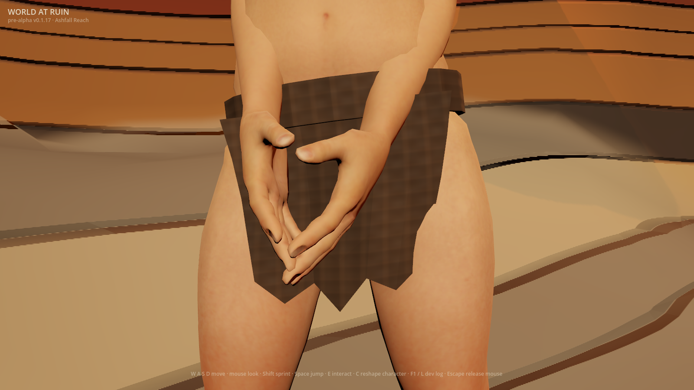
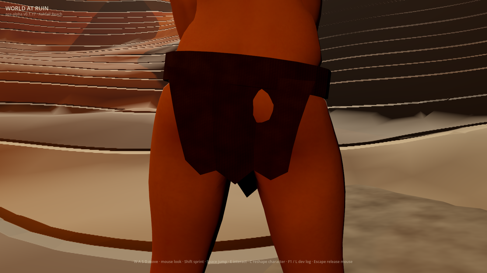
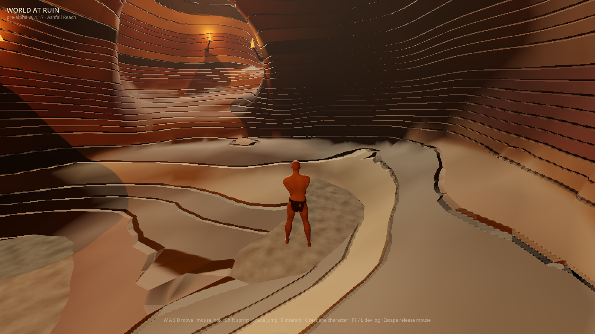
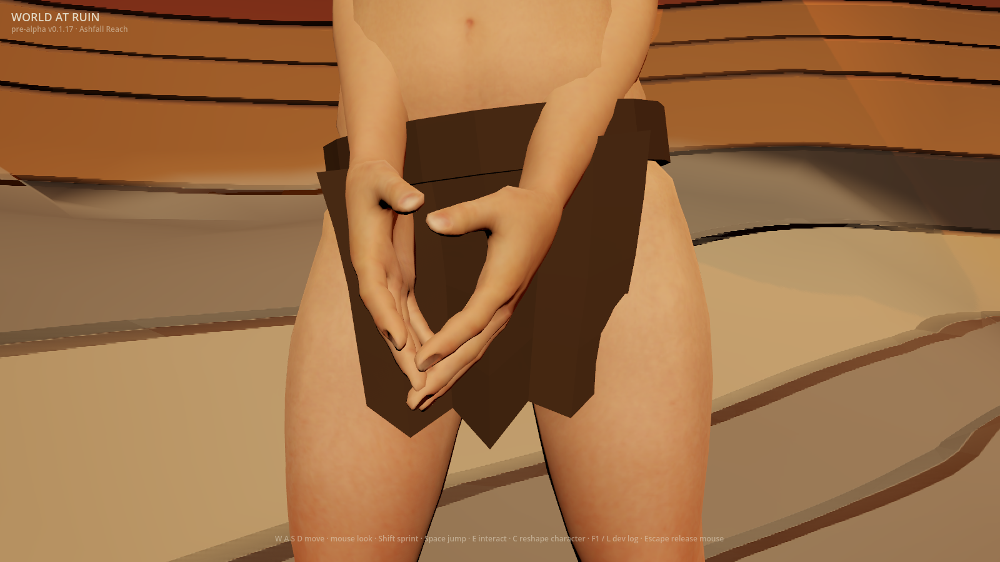

# Ragged cloth inspection (#946)

The opt-in `WAR_RAGGED_CLOTH_DETAIL=1` gives the existing immutable base a
deterministic woven surface: uneven warp/weft relief, seeded stains and varying
matte roughness. The kit's colour family and geometry remain intact. Ordinary
launches retain the baked material.

The material clamps its normalized 0–1 garment UVs while retaining anisotropic
mipmap filtering. Repeating anisotropy exceeded the sampler range on the hosted
Apple5 Metal device and made the preview fail to render; the garment does not
need a repeat sampler. The compositor regression checks both the clamp setting
and the actual UV bounds. The capture still rejects shader errors or a missing
garment mask.

## Actual frames

Godot 4.7.1, Apple M2 Pro, Metal Forward+, 1600×900, 2026-10-01. Ordinary
frames use the native source client; opted-in frames use the rebuilt native
macOS export. The real first-run creator selected Wanderer and emptied the wardrobe
through its production mutation path. Player/scenery clocks and idle were held
fixed. Front/rear inspection uses a 36° lens; gameplay selects the player's
actual 70° follow camera and its unchanged 4.6 m spring arm. The local GPU
supports volumetric fog.

| Ordinary material | Opted-in preview |
|---|---|
|  |  |
|  |  |



The broad printed grid gives way to yarn-scale relief in the front view.
At gameplay distance the mipmaps average fine detail. The rear stays dark
under existing cave light. These whole captured frames were not retouched.

## Does the camera resolve a material change?



Each view renders the actual material twice, a flat-material ablation, and an
unlit magenta visibility mask. The comparison samples **only pixels the garment
draws**, avoiding scenery changes. Close views sample every other pixel;
minified gameplay samples every garment pixel. The flat arm preserves opacity/culling and
mean cloth colour, removing albedo, normal and roughness maps. Each close view
must separate from repeat-frame noise before the scenario reports success.

| Preview view | Sampled garment pixels | Flat-arm mean maximum-channel difference | Repeat-frame noise |
|---|---:|---:|---:|
| Front | 34,033 | 0.01746 | 0.00000 |
| Rear | 41,935 | 0.00816 | 0.00000 |
| Gameplay | 982 | 0.00539 | 0.00001 |

These describe this run on one machine, not an across-machine quality or
performance score. CI captures both flag states with the same controls and
requires actual garment pixels and exact scenario/frame output.
The artifact includes both capture logs with the per-view mask counts,
ablation signal, repeat noise and final flag-state verdict beside the frames.

## Named reference and remaining gap

The ragged-start reference from the approved
[art direction](../../art-direction/README.md#characters-clothing-and-equipment-222-224-228)
is the official **Elden Ring Wretch**:
[reference page](https://en.bandainamcoent.eu/elden-ring/elden-ring/characters/wretch),
[viewed Wretch1 image](https://static.bandainamcoent.eu/high/elden-ring/elden-ring/05-characters/classes-gallery/assets/ELDEN-RING-Class-Wretch1.jpg).
The target is small subdued cloth whose folds/material read separately from
skin. The image was viewed online, never downloaded or used as generation input.

This is an inspection preview, **not an AAA match**. The rigid flap silhouette,
thick belt, planar mapping and existing rear opening remain. Drape, seam
construction, loose fraying and cloth motion are unauthored. Skin/cave
composition also remain below the reference. The preview stays default-off;
#222 / #1 remain open. Empty waist, neck, ring and trinket regions are outside
this slice.
The material activation/removal decision is tracked by #947, with a review due
2026-11-01. The date never automatically enables the preview.

### Originality note

- **Abstract target:** sparse worn cloth reads separately from skin, with fibre
  relief rather than a broad printed grid.
- **Independent expressive choices:** existing angular wrap and brown palette;
  original 96×128 uneven warp/weft arithmetic with alternating raised strands;
  seed-946 stain/matte fields; existing Ashfall cave light and independent fixed
  inspection cameras.
- **Excluded expression:** no Wretch geometry, outfit cut, textures, body, weapon,
  lighting composition, environment, icon or third-party frame is copied.
- **Input provenance:** unchanged first-party kit with its documented provenance,
  original GDScript arithmetic, engine noise and local game captures.
- **Remaining similarity risk:** the generic near-naked ragged-start premise is
  shared by the approved direction; distinctive reference expression is excluded.
  Future garment geometry still needs its own evaluation.

## Reproduce

Use a new private directory with an absent character save. Repeat with flag
`0` for the original material.

```sh
mkdir -p /tmp/war-cloth-inspection
WAR_RAGGED_CLOTH_DETAIL=1 WAR_SCENARIO=ragged_cloth \
WAR_SHOT_DIR=/tmp/war-cloth-inspection \
WAR_SAVE_PATH=/tmp/war-cloth-inspection/character.json \
WAR_VAULT_PATH=/tmp/war-cloth-inspection/vault.json \
WAR_BOOT_RECOVERY_PATH=/tmp/war-cloth-inspection/recovery.json \
godot --path client --resolution 1600x900 res://tools/frame_capture.tscn
```

All save seams are redirected. The exported client uses the same command with
`WAR_CAPTURE=1` and the app executable replacing the Godot/scene arguments.
The capture refuses headless rendering, an existing character save, an absent
garment or close frames that cannot discriminate the flat ablation.
