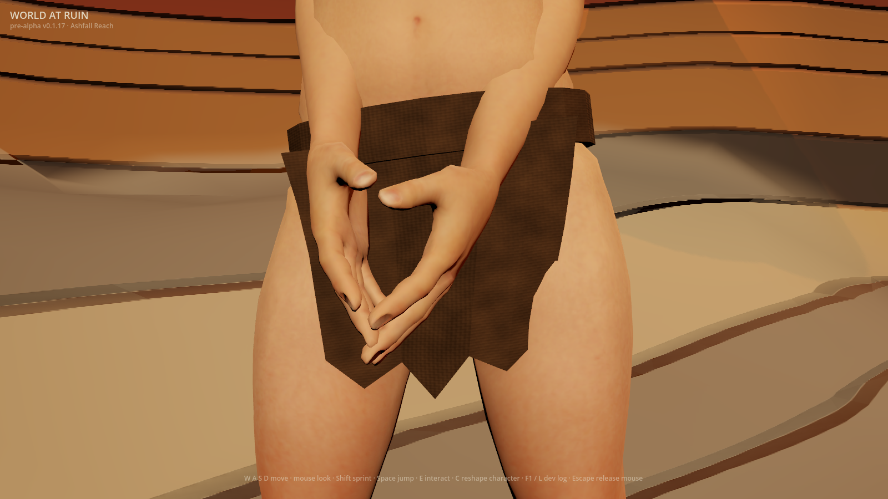
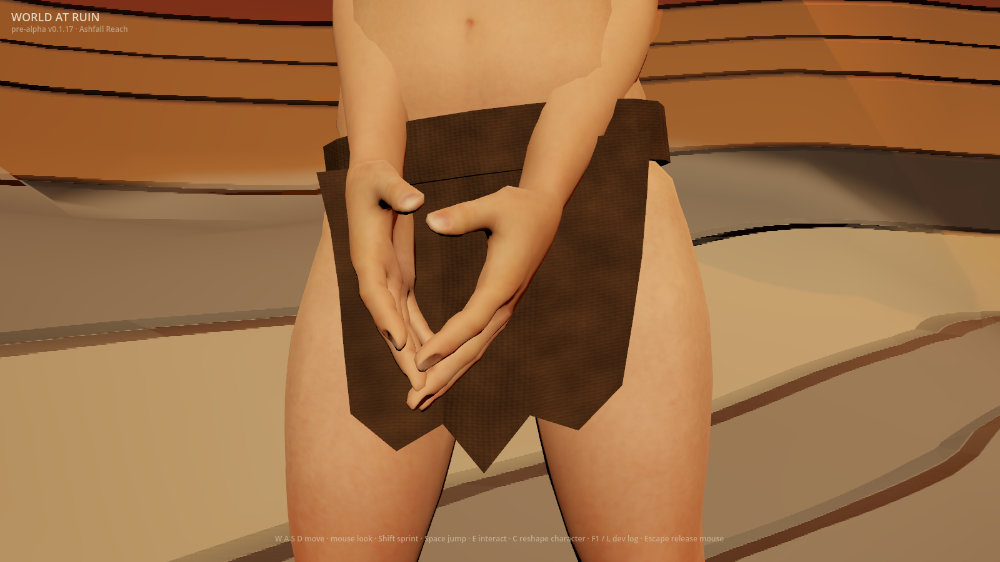
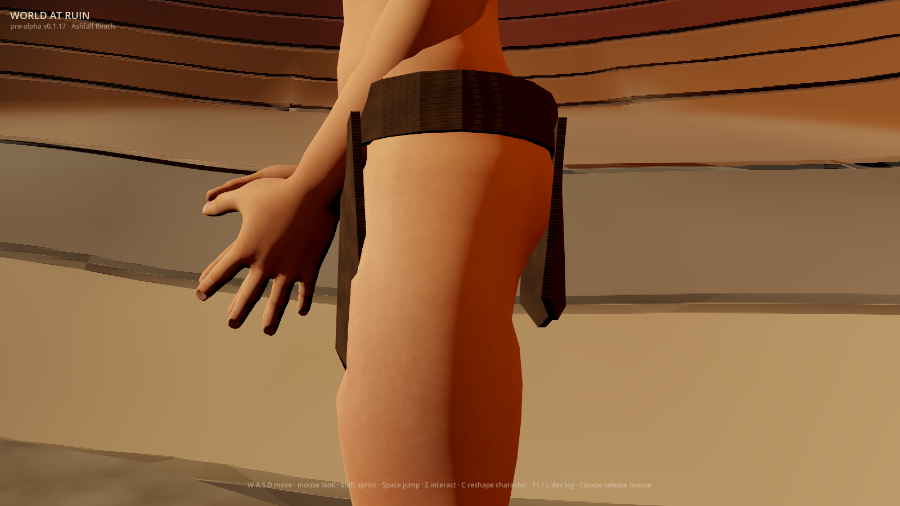
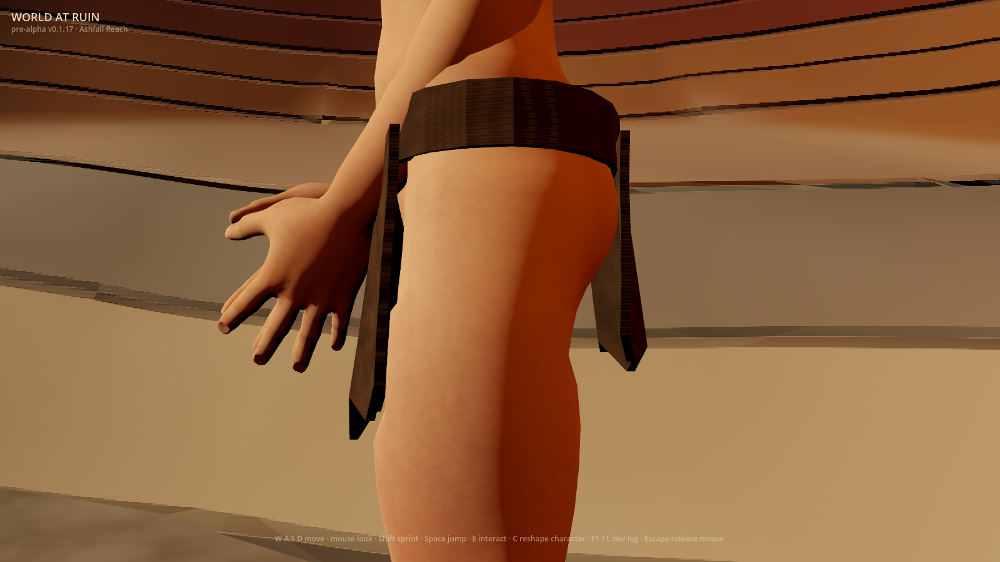
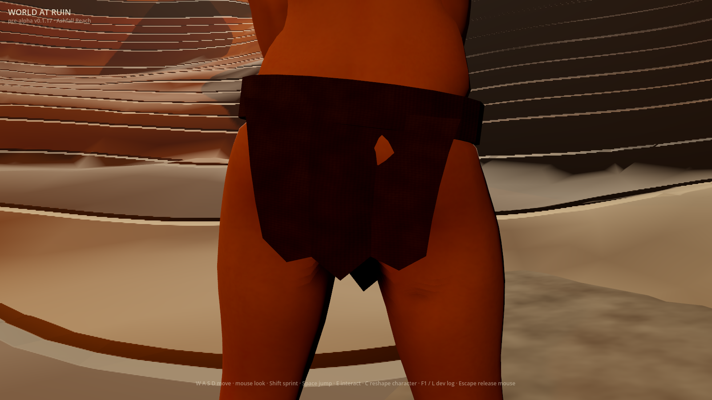
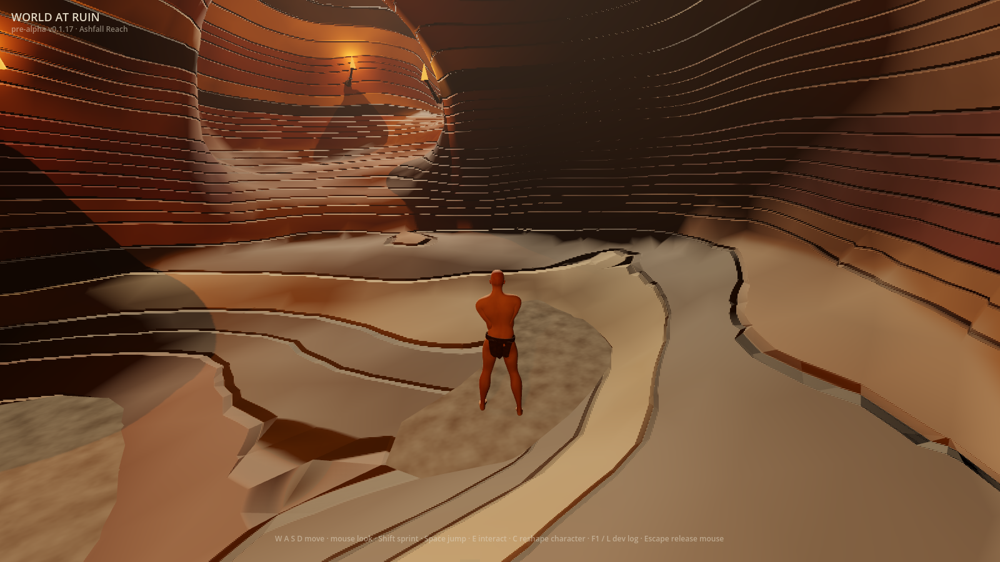

# Ragged-wrap geometry preview (#949)

`WAR_RAGGED_CLOTH_DRAPE=1` applies original static outward folds to a private
copy of the permanent ragged wrap. The waist attachment stays pinned; the
hanging panels flare and sag slightly. The baked asset, topology, UVs, skin
bindings and every saved positional morph delta remain unchanged. Ordinary
launches retain the shipped geometry. `WAR_RAGGED_CLOTH_DETAIL` is independent.

## Actual frames

Godot 4.7.1, Apple M2 Pro, Metal Forward+, 1600×900, 2026-10-01. These whole,
unretouched source-client frames show the actual Wanderer first-run composition
with all wardrobe selections empty. Both flags are on. The control swaps only
the mesh back to its shipped geometry, retaining material, saved morph weights,
pose, light and camera. The camera centre comes from the source mesh in both
states. Front/rear/profile inspection uses the existing 36° lens; gameplay uses
the actual 70° follow camera and unchanged 4.6 m spring arm.

| Original geometry, same material | Geometry preview |
|---|---|
|  |  |
|  |  |





The front hem is wider and its folds catch light differently. The profile
exposes the outward hanging curve rather than hiding it behind the front panel.
The rear opening is still present. At gameplay distance the change is small.

## Evidence controls

Each view captures a repeat, a flat-material arm, and a geometry-flat arm with
material held constant. Unlit garment masks from **both** geometry states name
the union of drawn pixels, including changed silhouette edges. Background-only
pixels cannot improve the verdict. Every close view must separate geometry
signal from repeat-frame noise; gameplay records the distance read without
requiring magnified folds. Unit controls challenge the mask union, preserve
morph weights through both swaps, and assert the unchanged production camera.

| View | Geometry mask union samples | Geometry signal | Repeat noise |
|---|---:|---:|---:|
| Front | 40,228 | 0.09103 | 0.00000 |
| Rear | 45,689 | 0.03262 | 0.00000 |
| Profile | 19,938 | 0.13784 | 0.00000 |
| Gameplay | 1,088 | 0.02731 | 0.00002 |

Signal is mean maximum-channel colour difference over that mask union. These
numbers describe this machine/run, not an art score or cross-machine benchmark.
CI renders all four independent material/geometry combinations, requires the
exact final flag verdict, and publishes all 24 frames plus metrics per state.
Historical v1–v4 recipes also exercise all combinations through the actual
compositor. Their CPU oracle applies morphs before skinning; it does not confuse
rest vertices with the geometry the renderer draws. Every original morph delta,
index, UV, bone and weight is checked, including grandfathered saved values.

## Named reference and remaining gap

The approved ragged-start reference is the official **Elden Ring Wretch**:
[reference page](https://en.bandainamcoent.eu/elden-ring/elden-ring/characters/wretch),
[Wretch1 image viewed online](https://static.bandainamcoent.eu/high/elden-ring/elden-ring/05-characters/classes-gallery/assets/ELDEN-RING-Class-Wretch1.jpg).
It was viewed online without downloading it or using it as generation input.
Its sparse subdued garment reads as cloth within a cohesive character and
world composition.

This preview moves the hanging outline and fold lighting, but remains **below
the AAA reference**. The angular panels, thick waist band, rear opening,
unstitched joins, absent fraying and cloth motion remain. Body shading and cave
composition also need work. No motion acceptance is claimed: this change is
static geometry. #222 and Phase 0 #1 remain open. Empty accessory regions stay
outside this slice. Geometry acceptance/removal is #950; material acceptance
remains #947. Both dates are 2026-11-01 and never activate either preview.

### Originality note

- **Abstract target:** a small worn cloth has gravity-shaped folds and a hanging
  profile distinguishable from skin.
- **Independent expressive choices:** the existing angular brown wrap, pinned
  thick belt, original two-wave outward fold field with a shallow asymmetric
  phase, modest widening and hem sag, and the game's own cave light/cameras.
- **Excluded expression:** no Wretch mesh, cut, texture, character, weapon,
  framing or environment was copied.
- **Input provenance:** unchanged first-party kit, original GDScript arithmetic,
  and whole first-party game captures. No third-party files or new dependencies.
- **Remaining similarity risk:** the broad near-naked ragged-start premise is
  shared by the approved direction; the reference's distinctive expression is
  excluded and future tailoring needs a separate judgment.

## Reproduce

Create a new private directory with an absent character save. Change the two
flag values independently to inspect every combination.

```sh
mkdir -p /tmp/war-drape-inspection
WAR_RAGGED_CLOTH_DRAPE=1 WAR_RAGGED_CLOTH_DETAIL=1 WAR_SCENARIO=ragged_cloth \
WAR_SHOT_DIR=/tmp/war-drape-inspection \
WAR_SAVE_PATH=/tmp/war-drape-inspection/character.json \
WAR_VAULT_PATH=/tmp/war-drape-inspection/vault.json \
WAR_BOOT_RECOVERY_PATH=/tmp/war-drape-inspection/recovery.json \
godot --path client --resolution 1600x900 res://tools/frame_capture.tscn
```

For the exported client, add `WAR_CAPTURE=1` and replace the Godot/scene arguments
with its executable. All save seams must remain redirected. Headless captures,
existing saves, missing garment pixels, rendering errors and close views that
cannot resolve a geometry change fail instead of supplying acceptance evidence.
