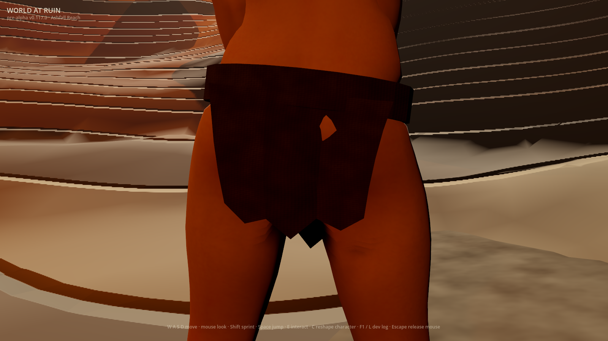
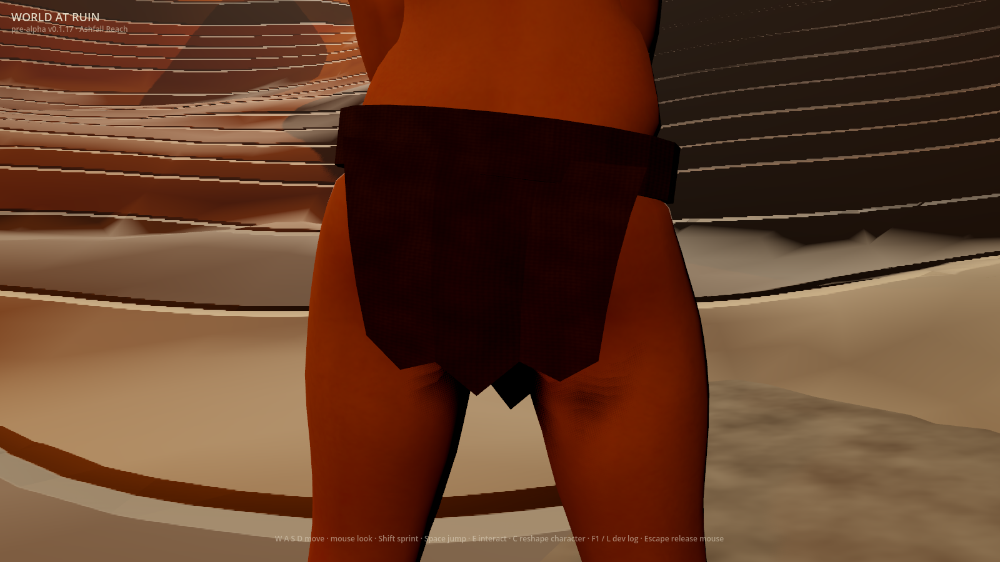
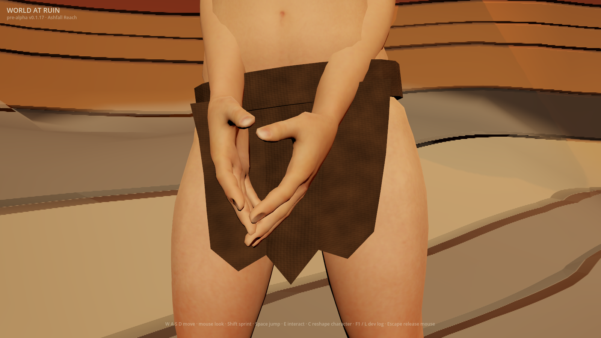
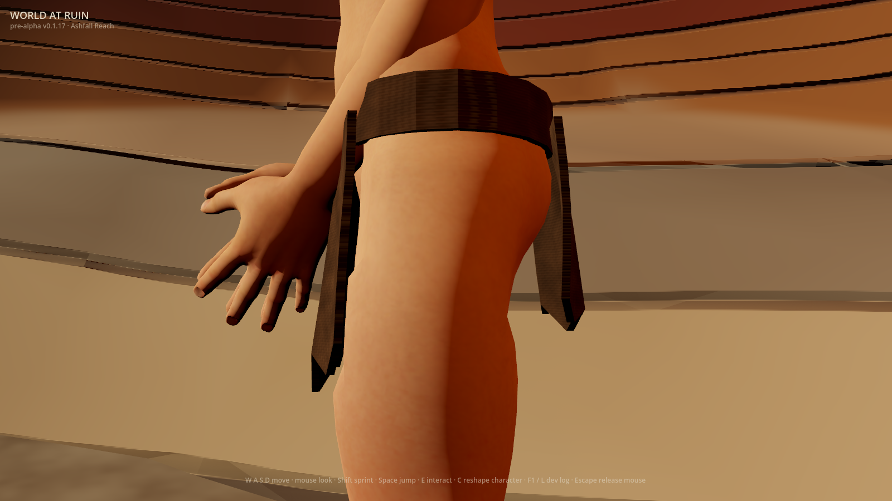
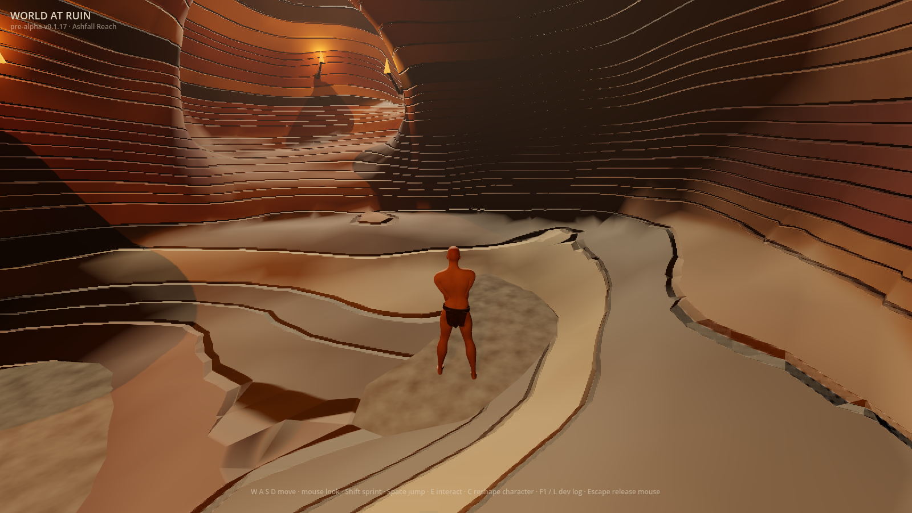

# Rear-wrap coverage repair (#952)

The optional drape preview exposed a small patch of skin below the rear belt.
It was body penetration, rather than a missing cloth triangle: the exterior
panel sat about 2.5–2.9 mm inside several drawn body shapes. A smooth rear
allowance now clears that curvature while leaving the waist pinned. The
existing `WAR_RAGGED_CLOTH_DRAPE=1` opt-in and #950's 2026-11-01 decision remain.

## Whole rendered frames

Godot 4.7.1, Apple M2 Pro, Metal Forward+, 1600×900, 2026-10-02. The before
frame is the verified released v0.117.0 executable; the after frames are this
source change. The source HUD retains its development version and is not a
release receipt. Both runs use the actual Wanderer first-run composition,
empty wardrobe, both cloth flags, and absent private saves. The capture fixes
pose, camera and time through the existing inspection harness. Images are
whole and unretouched; exact bytes are in `docs/first-party-captures.sha256`.

| Released preview before repair | Source preview after repair |
|---|---|
|  |  |

The rear opening is closed. The profile shows the additional rear clearance;
front folds and waist attachment retain their existing read. At gameplay
distance the repair is small. The camera remains the existing 36° inspection
lens and actual 70° gameplay lens with the unchanged 4.6 m spring arm.

Each view also rendered its repeat, flat material, unlit garment mask, original
geometry with the same material, and original-geometry mask: 24 frames total.
The mask union includes changed silhouette pixels and excludes background.
Front/rear/profile geometry signals were 0.09101/0.03977/0.15706 with zero
repeat noise; gameplay was 0.03836 with 0.00003 noise. These are local control
measurements against original geometry, not an art score or a quantitative
before/after repair benchmark. CI retains all frames and controls in all four
independent material/drape flag combinations.

## Discriminating coverage regression

`ragged_rear_coverage_test` builds the real compositor, applies saved morphs
before the actual standing skeleton, and samples exterior triangle interiors
as well as vertices. Its independent XY ray oracle intersects the drawn body
triangles and compares the nearest rear surface. Source normals select the
exterior panel only; they never decide clearance. Every sample must hit a body,
and empty/off-triangle controls fail. Translating the same panel 20 mm into the
body must also fail. No drape arithmetic participates in that verdict.

| Representative case | Before, minimum mm | After, minimum mm | Buried control, mm |
|---|---:|---:|---:|
| Wanderer | -2.608 | 3.601 | -16.399 |
| Villager | 8.470 | 14.467 | -5.533 |
| Elder | 3.111 | 6.211 | -13.789 |
| Brute | -2.874 | 3.334 | -16.666 |
| Historical v1, wide saved hips | -2.464 | 3.324 | -16.676 |
| Historical v2 | -2.478 | 3.364 | -16.636 |
| Historical v3, wide saved hips | -2.468 | 3.336 | -16.664 |
| Historical v4 | -2.478 | 3.364 | -16.636 |

Each case has 117 panel samples and requires at least 0.1 mm clearance. The
regression failed against the original production code, then passed with the
rear allowance. Existing drape tests still check all flag states, private mesh
ownership, unchanged source arrays, index/UV/bone/weight identity, pinned belt,
finite lighting frames and every positional morph delta. Saves are unchanged.
The coverage claim is deliberately limited to the upper rear panel in this
standing pose and these representative recipes; it does not promise all
unbounded legacy combinations or moving poses.

## Reference, originality and remaining gap

The approved view-only reference remains the official
[Elden Ring Wretch](https://en.bandainamcoent.eu/elden-ring/elden-ring/characters/wretch).
Its sparse, subdued cloth reads within a coherent character and environment.
This repair targets opaque coverage; it adds no reference media or assets.
The independent expression remains this game's angular brown wrap, thick
pinned belt, original static fold field, smooth 8 mm rear allowance and cave
light/cameras. No reference mesh, cut, texture, character or framing was copied.
Inputs are the unchanged first-party kit, original GDScript and first-party
captures. The broad ragged-start premise is shared with the approved direction;
distinctive reference expression stays excluded under the originality policy.

The wrap remains below the AAA reference: angular panels, a thick waist band,
unstitched joins, absent fraying and cloth motion still need work. Body shading
and the cave composition also remain unfinished. #222 and Phase 0 #1 stay open;
this does not accept the art gate or enable the preview. #950 retains the drape
accept-or-retire decision and #947 retains the material decision.

Reproduce the geometry regression with
`tools/run-client-test.sh ragged_rear_coverage_test`. Reproduce whole frames
using the [existing isolated capture recipe](../issue-949-ragged-drape/README.md#reproduce).
