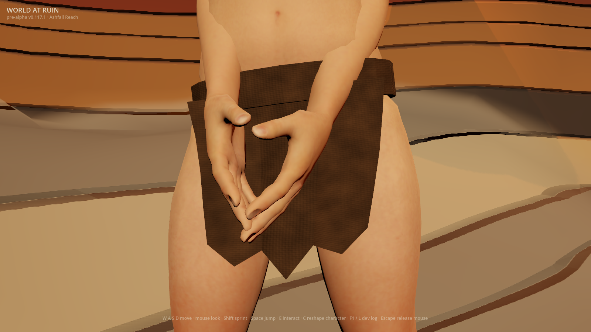
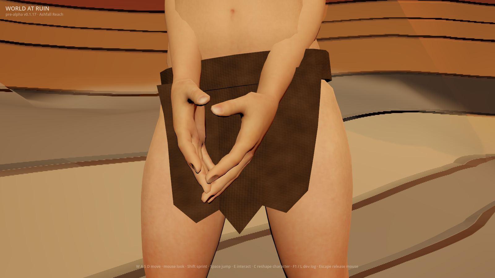
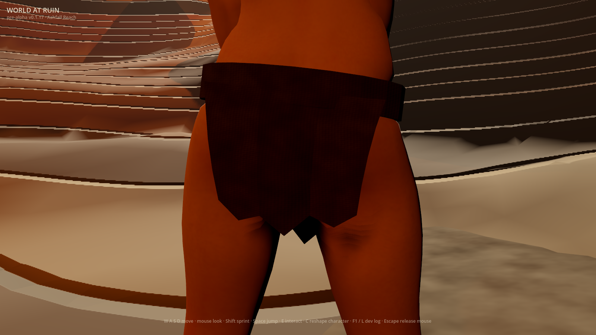
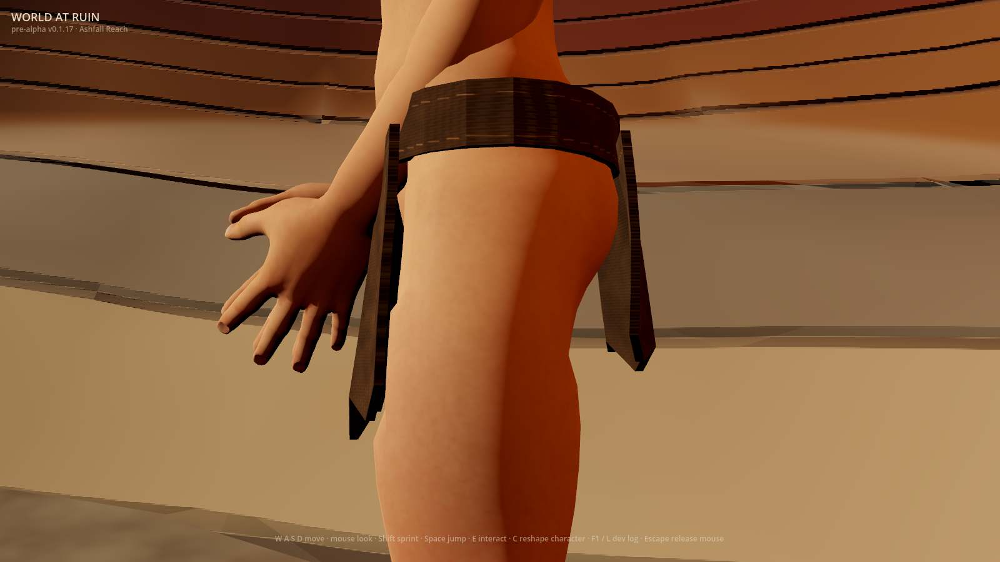
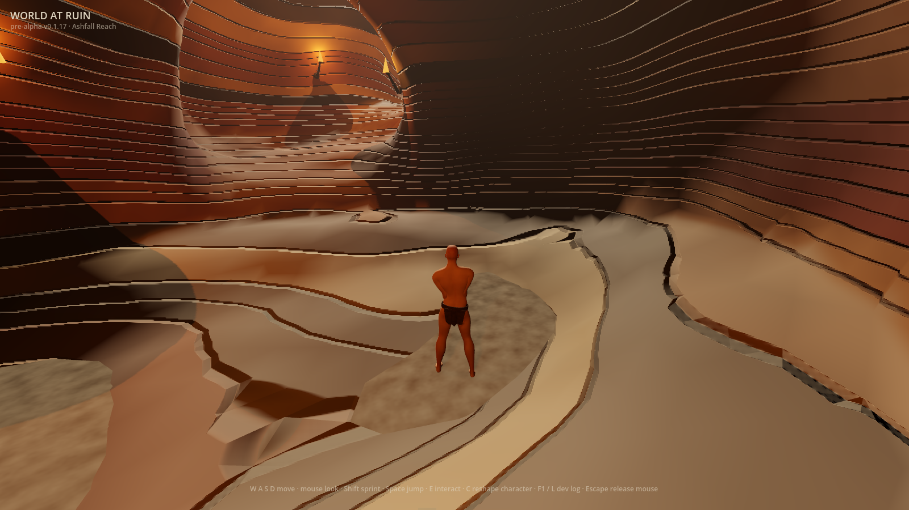

# Sewn wrap preview (#954)

The existing default-off `WAR_RAGGED_CLOTH_DETAIL=1` preview now has two
running-stitch rows around the waist and inset reinforcement along the hanging
panels. Short, rubbed threads vary in length, slant and tone. Their rounded
cross-section changes the normal map as well as colour; roughness stays matte.
The original weave, opaque coverage, geometry and saved characters remain.
The independently enabled drape preview and both November decisions stay open.

## Whole rendered frames

Godot 4.7.1, Apple M2 Pro, Metal Forward+, 1600×900, 2026-10-02. The before
frame comes from the verified released v0.117.1 trial. The after and seam-off
frames come from this source change; their development HUD is not a release
receipt. Each uses the actual Wanderer first-run composition, empty wardrobe,
both opt-ins and absent private saves. Pose, light and camera are fixed by the
existing capture harness. Images are whole and unretouched; their exact bytes
are registered in `docs/first-party-captures.sha256`.

| Released woven preview | Source sewn preview |
|---|---|
|  |  |

| Actual tailoring | Same weave with sewing removed |
|---|---|
|  |  |
|  |  |

Stitches are visible at inspection range, more subdued in the rear shadow.
They do not turn the silhouette into softer cloth. Individual threads remain
small at gameplay distance; the 70° follow camera and 4.6 m spring arm are
unchanged. The inspection lens remains 36°.

## Discriminating evidence

The sewing-only ablation rebakes from the imported kit's original palette and
removes the thread fields. It keeps the same weave, material settings, geometry,
pose, lighting and camera. Its unaffected weave texels are byte-identical.
All four material/drape combinations produce seven arms per view: actual,
repeat, seam-off, flat material, garment mask, original geometry and its mask.
CI requires all 28 whole images and sidecars in each combination.

The localized metric averages the strongest tenth of differences **inside the
actual garment mask**, for both sewing and repeat noise. The previous whole
garment mean diluted the sparse construction to 0.00243 in the front view.
The upper-decile statistic measures a region rather than one peak pixel, and
does not admit scenery. Synthetic unchanged, background-only and localized
positive controls exercise this distinction. Inspection must exceed three
times its own repeat noise plus 0.004; gameplay is diagnostic only.

| View | Upper-decile sewing signal | Repeat noise |
|---|---:|---:|
| Front | 0.02430 | 0.00000 |
| Rear | 0.01757 | 0.00001 |
| Profile | 0.03143 | 0.00001 |
| Gameplay | 0.01069 | 0.00035 |

These are same-camera ablation measurements, not an art score. The new
`ragged_tailoring_test` first failed on the released weave-only implementation.
It samples broad literal waist bands on the real compositor's attached maps,
requiring both colour contrast and excess cross-seam normal response over
neighbouring weave. Colour-only sewing cannot pass the lighting assertion;
the weave-only controls cannot impersonate either criterion. At the two rows,
source contrast is 0.06157/0.05946 and excess normal response 0.31031/0.23096.
Existing material/drape tests retain source isolation, opacity, deterministic
mips, positional morphs and historical save checks.

## Reference, originality and remaining gap

The view-only approved reference is the official
[Elden Ring Wretch class image](https://static.bandainamcoent.eu/high/elden-ring/elden-ring/05-characters/classes-gallery/assets/ELDEN-RING-Class-Wretch1.jpg).
The abstract brief is sparse, subdued worked cloth that separates from skin.
Independent expression is this game's brown angular wrap, short staggered
ochre threads, tapered inset reinforcement and existing cave staging. Only the
unchanged first-party kit, original arithmetic and first-party captures are
inputs. No reference image, mesh, cut, outfit, palette or composition was
copied, downloaded into the repository or supplied to a generator. The broad
ragged-start premise remains shared; reference-specific expression is excluded.

The result is still below the approved art bar. The thick angular belt, hard
panels, abrupt ends of the reinforcement, absent loose fraying and cloth motion
remain visible limitations. Front and rear share a planar texture layout and
have different hems: the inset reinforcement stops above both and does not
claim to follow every ragged edge. Body shading and the cave also need work.
#222 and Phase 0 #1 remain open; #947 and #950 retain their November decisions.
This increment neither accepts the art gate nor turns either preview on.

## Reproduce

Run `tools/run-client-test.sh ragged_tailoring_test` and
`tools/run-client-test.sh ragged_cloth_capture_test` from the repository root.
Use the [isolated capture recipe](../issue-949-ragged-drape/README.md#reproduce)
with both opt-ins, `WAR_SCENARIO=ragged_cloth` and a new private output directory.
The scenario writes the additional `*_seam_off.png` and `.txt` controls.
