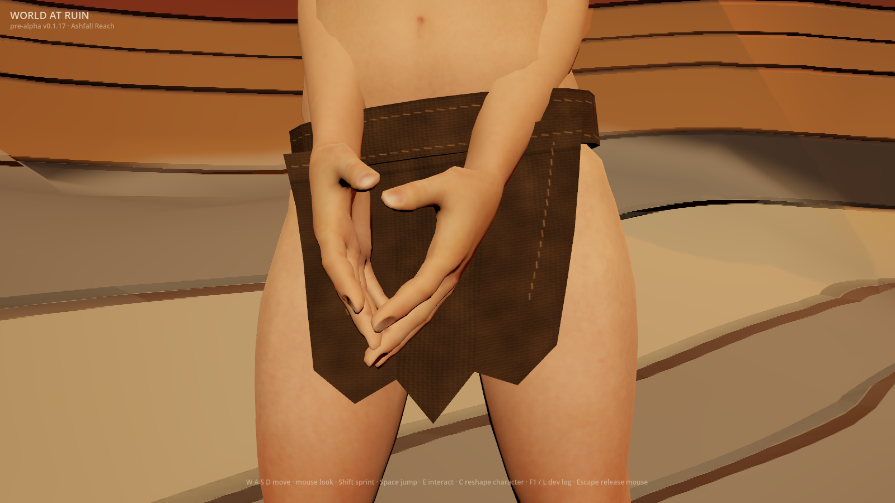
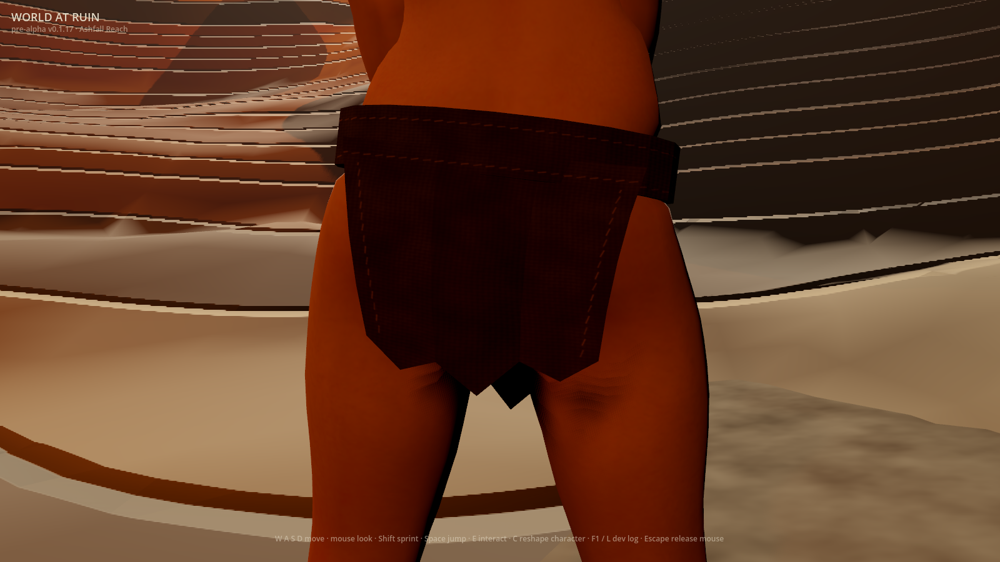
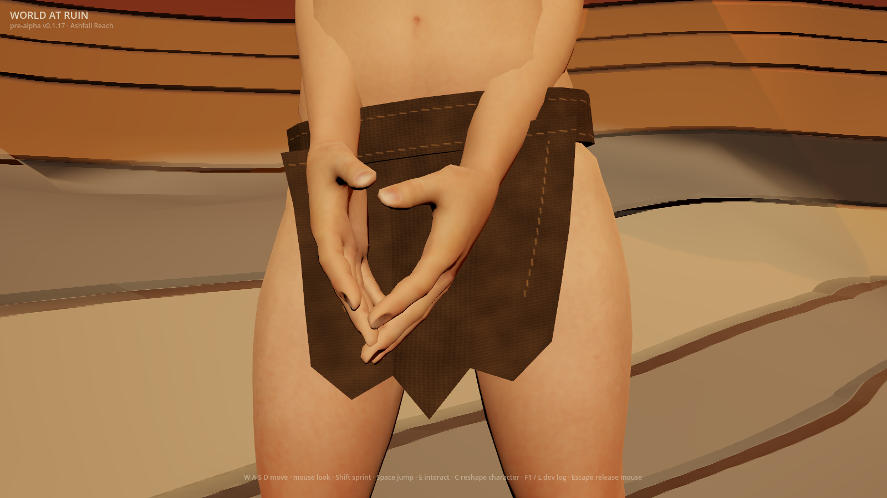
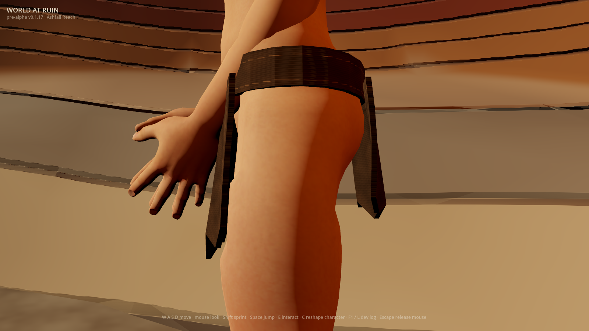
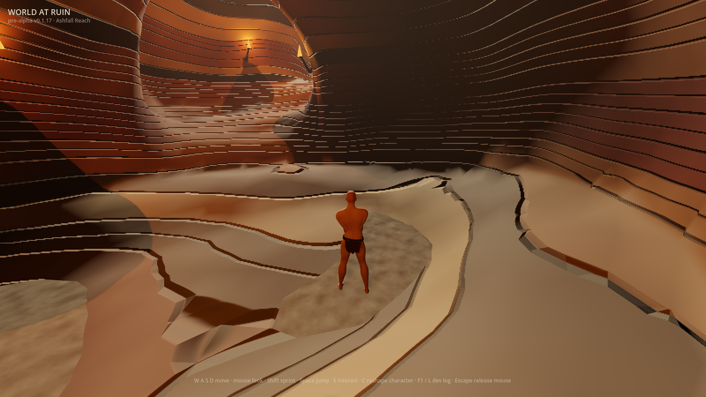

# Gathered wrap preview (#958)

`WAR_RAGGED_CLOTH_DETAIL=1` gives the permanent ragged wrap broad, uneven
gathers and rounded folded-edge lighting alongside its weave and worn sewing.
`WAR_RAGGED_CLOTH_DRAPE=1` independently eases the hanging panel into its fixed
waist over ten millimetres. Both previews remain default-off. The closed opaque
base, imported assets, historical positional morphs and saved characters stay
intact; these are static folds, without cloth simulation.

## Whole actual game frames

Godot 4.7.1, Apple M2 Pro, Metal Forward+, 1600×900, 2026-10-02. Before frames
come from verified source main `78d38c5`; after and fold-off frames come from
this delivery's final source. All use the actual first-run Wanderer with an
empty wardrobe, absent temporary saves, both previews enabled and the same
pinned pose, light and camera. The development HUD is not a release receipt.
Images are whole, unretouched first-party captures; their exact bytes are in
`docs/first-party-captures.sha256`.

| Before | Gathered preview |
|---|---|
|  |  |
|  |  |

| Actual folds | Only broad folds removed |
|---|---|
|  |  |
|  |  |





The inspection frames show broader light and shade on the hanging cloth than
the weave-only control. The effect remains restrained in the shadowed rear and
small at gameplay distance. Rounded edge lighting does not change the thick
waist silhouette. Inspection uses the established 36° lens; gameplay uses the
actual 70° follow camera and 4.6 m spring arm.

## Discriminating evidence

The fold-off arm removes only broad fold colour and normal relief. Mesh,
weave, stitches, roughness, pose, light and camera remain. Sewing-off continues
to remove only thread fields while retaining folds. The unlit garment mask
names the pixels the cloth actually draws; background pixels cannot credit a
fold. Close views must separate fold signal from repeated-frame noise, and CI
requires every fold-off frame in all four independent flag states.

| View | Garment samples | Fold-only signal | Repeat noise |
|---|---:|---:|---:|
| Front | 40,228 | 0.01856 | 0.00000 |
| Rear | 46,659 | 0.00763 | 0.00000 |
| Profile | 19,394 | 0.00980 | 0.00000 |
| Gameplay | 1,123 | 0.00612 | 0.00003 |

Signal is mean maximum-channel colour difference over actual garment pixels.
These are measurements of this run, not an art score or cross-machine target.
The new regression spatially averages the compositor's normal map to remove
fine yarns: lateral normal spread rises from **0.02630 to 0.41064**. The
folds-off map fails that relief criterion; a painted fold with flat normals
also fails. Independent rebakes reproduce every mip byte. Front waist
displacement slope falls from **0.14036 to 0.00015** near the attachment, and
its lighting frame approaches the pinned waist continuously.

Existing real compositor tests retain all four flag combinations, unchanged
UVs, topology, skin bindings, every historical positional morph delta and
shared-resource isolation. The independent skinned-body oracle retains at
least **3.324 mm** rear clearance across current presets and historical saves;
deliberately buried cloth and missing-body controls still fail.

## Reference and remaining gap

The approved ragged-start reference is the official **Elden Ring Wretch**:
[reference page](https://en.bandainamcoent.eu/elden-ring/elden-ring/characters/wretch),
[Wretch1 image viewed online](https://static.bandainamcoent.eu/high/elden-ring/elden-ring/05-characters/classes-gallery/assets/ELDEN-RING-Class-Wretch1.jpg).
It was viewed online, never saved in the repository or used as generator input.
Its sparse worn cloth sits within a cohesive body and world composition.

This is a useful **opt-in surface improvement, below the agreed AAA bar**.
The angular cut, thick waist silhouette, abrupt reinforcement ends, loose
fraying and cloth motion still need work. Broad normal relief cannot repair
those geometric and motion gaps; body shading and cave composition also remain.
No motion or Phase 0 acceptance is claimed. #222 and #1 stay open; empty
accessory slots remain outside this slice. #947 and #950 retain their separate
2026-11-01 accept-or-retire decisions; the dates never activate a preview.

## Originality

- **Abstract target:** sparse worn fabric shows broad gathered weight and
  rounded folded edges through light, distinct from skin and fine yarns.
- **Independent choices:** the existing angular brown two-panel wrap; four
  uneven, fanning gathers with an independently authored slope field; narrow
  folded-edge rolls outside the worn stitch rows; first-party cave lighting,
  fixed inspection lenses and unchanged gameplay camera.
- **Excluded reference-specific expression:** no Wretch cut, mesh, texture,
  character, weapon, framing or environment was copied.
- **Inputs and provenance:** unchanged first-party kit, original arithmetic
  and whole first-party runtime captures. No reference media or new dependency.
- **Remaining similarity risk:** the approved near-naked ragged-start premise
  is shared; the reference's distinctive expression is excluded. Future garment
  geometry and motion still need their own reference-distance judgment.

## Reproduce

Use a new directory with absent save files. Set material and geometry flags
independently to inspect every combination. The capture includes repeat,
fold-off, sewing-off, flat-material and geometry-flat controls.

```sh
mkdir -p /tmp/war-gathered-inspection
WAR_RAGGED_CLOTH_DETAIL=1 WAR_RAGGED_CLOTH_DRAPE=1 WAR_SCENARIO=ragged_cloth \
WAR_SHOT_DIR=/tmp/war-gathered-inspection \
WAR_SAVE_PATH=/tmp/war-gathered-inspection/character.json \
WAR_VAULT_PATH=/tmp/war-gathered-inspection/vault.json \
WAR_BOOT_RECOVERY_PATH=/tmp/war-gathered-inspection/recovery.json \
godot --path client res://tools/frame_capture.tscn
```
