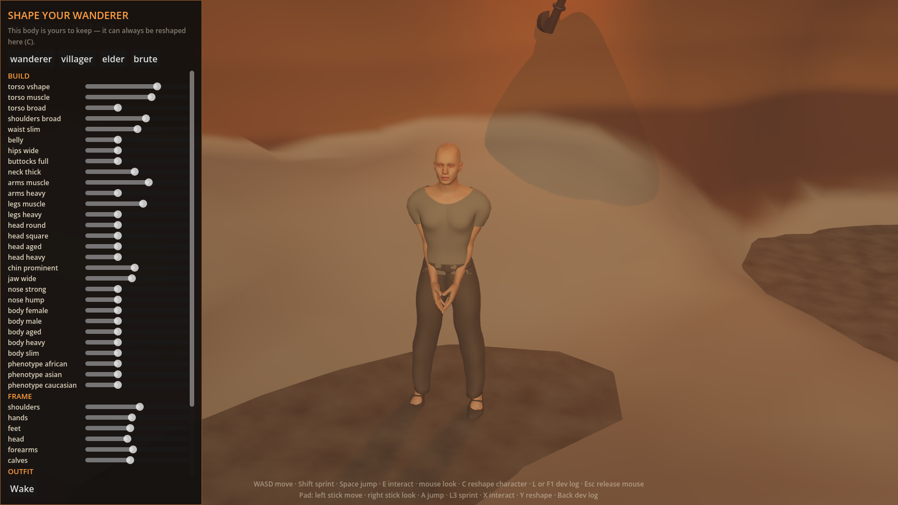
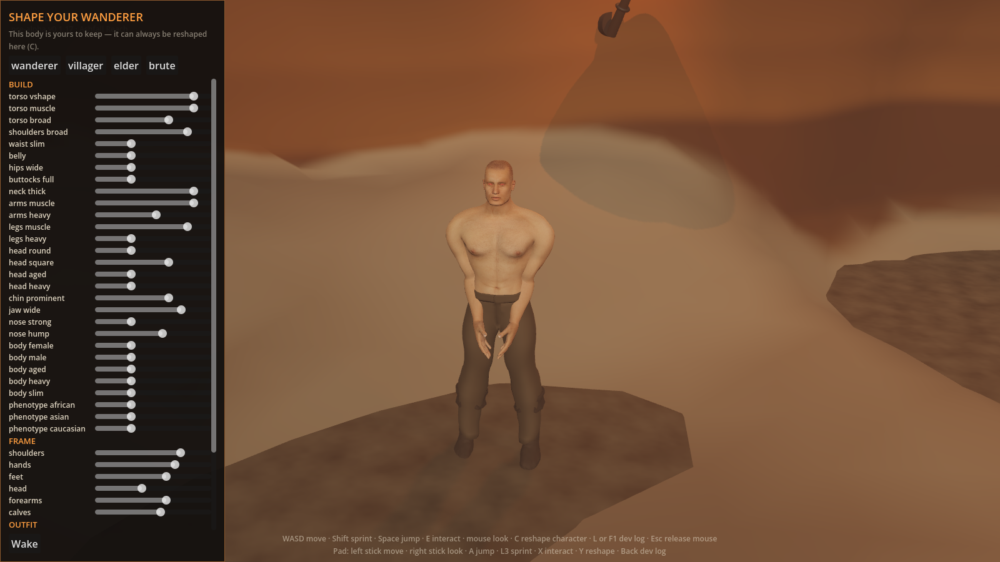
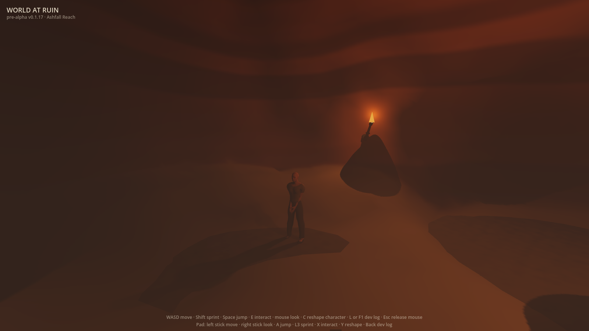
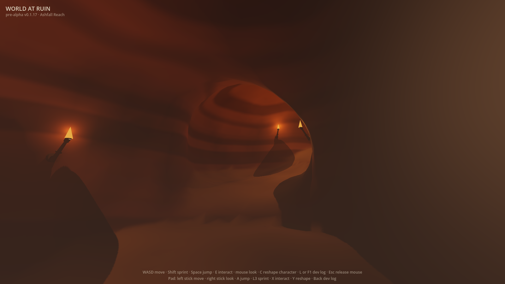

# Phase 0 — the taste gate

**This page exists to be looked at.** [Issue #1](https://github.com/devantler-tech/world-at-ruin/issues/1)
asks the one question the project cannot answer with a test: can *generated* art reach the bar?

**The criterion is the [Quality bar](../../AGENTS.md#quality-bar--it-has-to-resemble-a-aaa-game) —
AAA resemblance**, not the softer "would not be embarrassed to show" wording #1 was originally filed
with. "Functional but basic" is a defect, not a milestone, and that standard governs here too.

Everything below was rendered from the running game. Nothing was posed in an editor, retouched, or
hand-made.

> ## ❌ Verdict: Phase 0 does NOT pass
>
> Recorded 2026-07-19. The maintainer's judgement, on
> [#219](https://github.com/devantler-tech/world-at-ruin/pull/219): *"This is not nearly good enough.
> The style is far from futuristic-medieval on all parameters."*
>
> The premise is **not** withdrawn — generated art is still the approach. What failed is the current
> output against the bar. The named gaps are tracked below.

**Captured from** [`8a4b723`](https://github.com/devantler-tech/world-at-ruin/commit/8a4b723) ·
Godot 4.7.1, Metal, Apple M2 Pro · 1600×900, the size the game ships at.

## The character

Generated by [`tools/artgen/humanoid_kit`](../../tools/artgen/humanoid_kit): headless Blender bakes
an MPFB2 CC0 base body, 29 named blend shapes, a 53-bone rig and CC0 skins into a glTF the client
loads at runtime. The sliders on the left *are* those blend shapes — the character is parametric all
the way down, which is the whole reason this style was chosen over sculpted detail.

Default, on waking:



The same system pushed to its other end, to show the range is real rather than a single baked body:



## The cave

Generated by [`client/scripts/cave_system_gen.gd`](../../client/scripts/cave_system_gen.gd): a
seeded room-and-tunnel graph becomes a signed distance field, and a surface-nets mesher walks the
zero surface. Lit by torches against SDFGI occlusion — the darkness is absence of light, not a fog
colour. Every player wakes in here.





## The named gaps

From the maintainer's verdict, in his words: the style is far from **futuristic-medieval** on all
parameters, and what is missing includes **animations**, **correct stances**, **multiple playable
races**, **better UI/UX**, **better textures** (said three times — treat the emphasis as real),
**a more varied and believable world**, and **better blending of structures, caves and terrain**.

**Direction:** find good references for how a AAA game looks in this style and chase *that*, in an
MMORPG setting. Progression is part of the look — a new player starts ragged and messy (From
Software's near-naked start, a scrap of cloth), and only later, having found their footing, do they
resemble the geared figures the reference search returns.

Photorealism remains out of scope — unreachable in Godot without a human sculptor. The target is
stylised-realistic, and the gap is fidelity within that style, not a change of style.

Each gap is tracked as an issue. **#221 comes first** — every other item is chasing a look nobody
has written down, which is how the frames above got shipped as "good enough" in the first place:

| Gap | Issue |
|---|---|
| Name the futuristic-medieval AAA target | [#221](https://github.com/devantler-tech/world-at-ruin/issues/221) (spike — blocks the rest) |
| Ragged start, layered clothing + armour slots | [#222](https://github.com/devantler-tech/world-at-ruin/issues/222) |
| Better textures — the game has none | [#223](https://github.com/devantler-tech/world-at-ruin/issues/223) |
| Animations and correct stances | [#224](https://github.com/devantler-tech/world-at-ruin/issues/224) |
| Blend structures and caves into terrain | [#225](https://github.com/devantler-tech/world-at-ruin/issues/225) |
| A more varied and believable world | [#226](https://github.com/devantler-tech/world-at-ruin/issues/226) |
| Better UI/UX | [#227](https://github.com/devantler-tech/world-at-ruin/issues/227) |
| Multiple playable races | [#228](https://github.com/devantler-tech/world-at-ruin/issues/228) |

## What is deliberately not being judged here

Controller glyph art, and combat, which does not exist yet. Animation *is* in scope per the verdict
above, despite being the known weak link.

## Regenerating this bundle

```sh
godot --headless --editor --quit --path client   # writes the class cache the capture needs
cp client/recipes/wanderer.json /tmp/probe_save.json

# The capture tool does not create its output directory — it fails on the first
# save_png if the directory is missing, which is why CI runs mkdir -p too.
mkdir -p /tmp/shots /tmp/shots-char

WAR_SHOT_DIR=/tmp/shots WAR_SAVE_PATH=/tmp/probe_save.json \
  godot --path client res://tools/frame_capture.tscn          # cave-*.png

WAR_SCENARIO=first_run WAR_SHOT_DIR=/tmp/shots-char WAR_SAVE_PATH=/tmp/no_such_save.json \
  godot --path client res://tools/frame_capture.tscn          # first_run*.png
```

The run must be **windowed** — headless renders nothing, and the capture tool refuses to run that
way rather than write a blank frame. Copy `first_run_wanderer`, `first_run_brute`, `cave-chamber`
and `cave-walkout` over the four files here.
