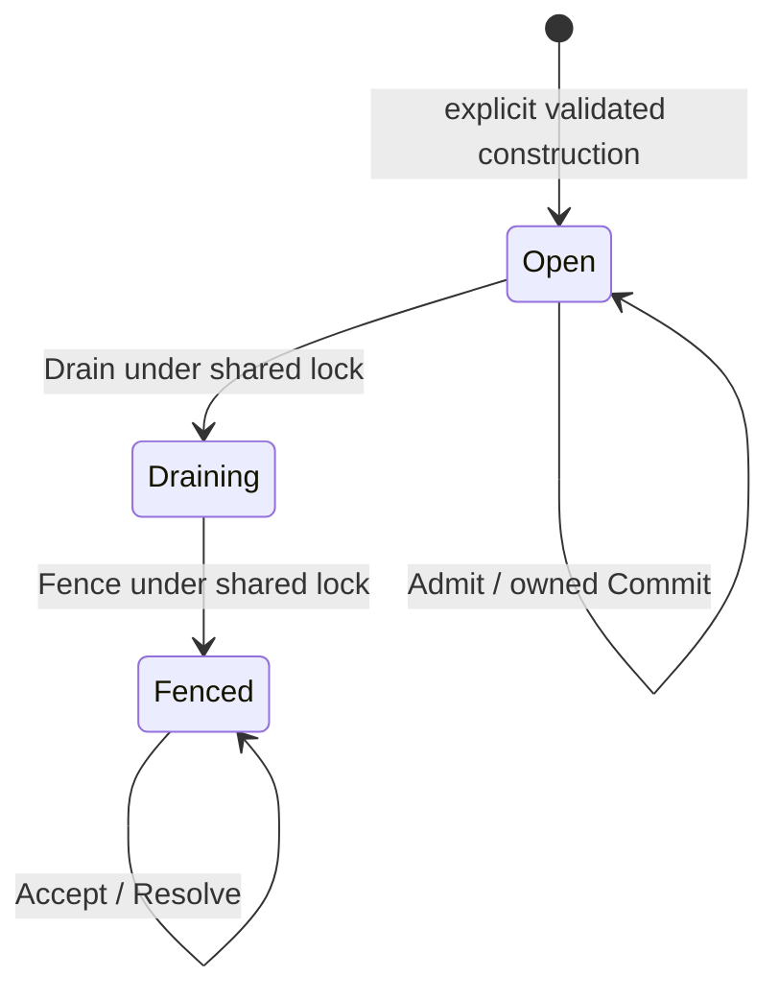

# Inactive allocator fence reference

This package demonstrates an allocator commit-authority protocol for its **own
in-memory ledger**. It is not a production Agones fence or a durable recovery
service. [ADR 0012](../../../docs/adr/0012-keep-allocator-fence-authority-at-the-commit-boundary.md)
defines its boundary and the remaining production gate in #793.

Run the executable example, race regressions and real TLS/generated Allocate RPC
proof from the repository root:

```sh
go -C server test -race -count=1 -timeout 2m ./internal/fencereference
```

The zero/default config returns `ErrDisabled`. Explicit construction requires an
open `nakamageneration.Record` with its complete sorted member set, canonical
digest and exact source version, plus one distinct trusted allocator-server SPKI
pin per UID. Pins must describe server identities issued and mapped by a trusted
operator, independently of the coordinator's client certificate. `TLSConfig`
retains chain/hostname verification and adds the exact server-key check; callers
must use that configuration for the generated RPC connection.

The external-package `ExampleReference` demonstrates the capability flow:

1. `Admit` issues one opaque ticket per attempt while the generation is open.
2. `Commit` checks that ticket and the current authority before writing its owned
   ledger under the same lock. Exact replay succeeds only while open.
3. `Drain` atomically closes admission and commit. It does not wait for transport
   cancellation or callback completion.
4. `Fence` returns the complete originating terminal receipt. `Accept` checks it
   against the pinned observation; `Resolve` requires that actual receipt before
   returning an allocation or definitive absence in this ledger.



Tickets, receipts and their authority are process-local. Handles may be copied
and share the same authority; a newly constructed instance cannot consume old
capabilities. There is no restoration, persistence, admission-budget reset or
resource release. Constructor enablement is for this inactive reference only;
there is no runtime flag to turn it into a production allocator.

The RPC fixture holds a real authenticated request before its commit. Without a
fence it changes the ledger, even after cancellation or a deadline; with an
accepted fence its late mutation is refused and the ledger is unchanged. An
allocation whose response was lost remains observable as committed. Identity
refusal controls require an observed certificate-verification error, so failure
to connect does not satisfy the proof. A production import guard keeps the
reference out of the command, plugin and adapter composition.

These observations concern this ledger only. Native Agones allocation and
Kubernetes writes require a separately reviewed commit-authority implementation.
Existing unknown dispatches remain quarantined; #793 and #569 are still open.
